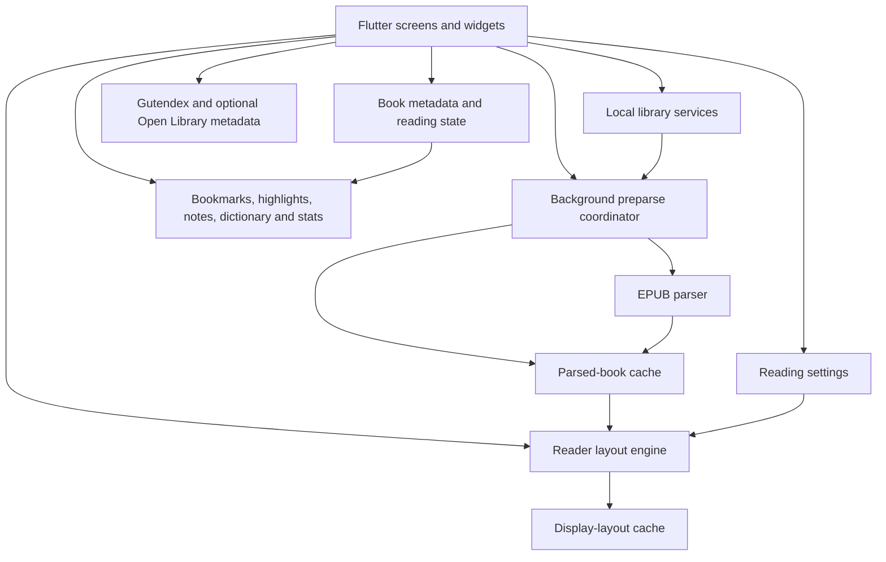
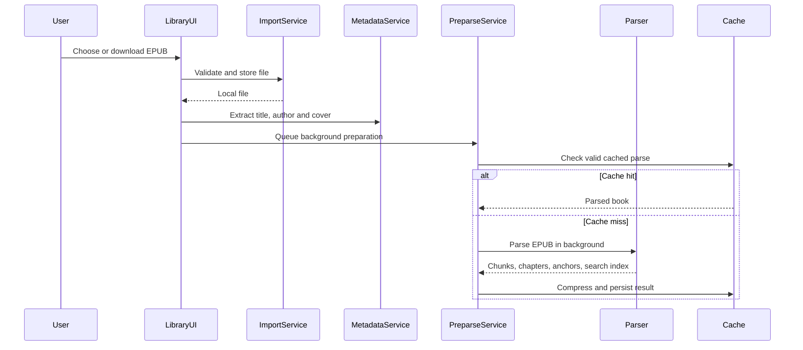

# Nalori architecture

This document describes the main runtime architecture of Nalori. It focuses on the parts that matter when maintaining the reader: import, EPUB parsing, display layout, persistence, annotations, and remote catalogue access.

## System overview

Nalori follows a service-oriented Flutter structure rather than placing storage, parsing, and networking directly inside widgets. Screens coordinate user flows; services own durable state and expensive work; models carry book and reader data between them.

## Main layers

| Layer | Responsibility | Representative locations |
|---|---|---|
| Presentation | Library, reader, settings, memory, search and catalogue flows | `lib/screens`, `lib/widgets`, `lib/ui` |
| Reader behaviour | Page navigation, speed reading, selection and display-page rebuilding | `lib/screens/reader_screen.dart`, `lib/controllers` |
| Domain models | Parsed chunks, chapters, annotations, settings and reading positions | `lib/models` |
| Application services | Import, parsing, caching, metadata, networking and persistence | `lib/services` |
| Parsing utilities | Text measurement, block parsing, source-range handling | `lib/utils` |
| EPUB dependency | Project-owned EPUB decoding package | `packages/epubx` |

## Book ingestion pipeline

Nalori supports two entry paths:

1. The user selects an EPUB from device storage.
2. The user downloads a public-domain EPUB from the catalogue.

Both paths end with an EPUB stored in the app's private books directory.

### Import and validation

`BookImportService` accepts EPUB files only, normalizes downloaded filenames, avoids duplicate copies, and stores books inside the application documents directory.

The library extracts metadata before presenting a newly discovered book. Invalid or malformed imports are rejected instead of leaving unusable entries in the library.

### Background preparation

`BookPreparseService` coordinates parsing work:

- checks whether a cache is still valid against the EPUB modification time;
- shares an existing future when the same book is already being parsed;
- prepares library books through a serial queue to avoid resource spikes;
- keeps the queue recoverable when one EPUB fails;
- writes successful results to the parsed-book cache.

## EPUB parsing model

`EpubParserService` reads EPUB bytes through the local `epubx` package and walks the book's HTML content.

The parser produces:

- semantic `BookChunk` objects;
- chapter and table-of-contents data;
- anchor-to-chunk mappings;
- a search index;
- source-file and source-range information used by navigation and annotations.

The parser recognizes more than plain paragraphs. It preserves or classifies headings, links, inline emphasis, footnotes, lists, images, dialogue, quotes, epigraphs, letters, poems, stanzas, preformatted blocks, and tables.

Long prose is split near sentence boundaries. Common abbreviations and initials are considered so that a period does not automatically become a sentence break. Publisher-oriented blocks retain stricter layout boundaries and line-break behaviour.

Parsing runs in a Dart isolate so HTML traversal and chunk construction do not block the main UI isolate.

## Parsing and layout are separate

A central design decision is that an EPUB is not permanently divided into visual pages during parsing.

The parser creates reusable semantic chunks. `ReaderScreen` then turns those chunks into display pages using the current runtime conditions:

- screen width and height;
- safe-area insets;
- text scaling;
- font family, size and weight;
- line height and paragraph spacing;
- side margins;
- content-density mode;
- card-depth presentation;
- publisher alignment and indentation.

Flutter text measurement is used to determine whether content fits. Oversized prose is split by sentence, then token, and finally character only when required. Compatible small chunks may be merged to avoid nearly empty cards.

This separation allows one parsed book to support different devices and reader settings without reparsing the EPUB.

## Cache strategy

Nalori maintains two conceptual cache levels.

### Parsed-book cache

Stores screen-independent data:

- title;
- semantic chunks;
- chapters;
- anchors;
- search index.

The data is serialized, compressed, and processed in an isolate. A manifest records file size, creation time, and last access. Modified EPUBs invalidate stale entries, and least-recently-used eviction keeps the cache within its configured budget.

### Display-layout cache

Stores display chunks and original-to-display mappings for a specific layout configuration. Its cache key includes typography, density, screen dimensions, safe areas, text scale, margins, and card mode. A layout-version component invalidates results when the layout algorithm changes.

## Reading position and source mapping

Display pages are derived from original chunks, so Nalori keeps mappings in both directions:

- display page to original chunk or chunks;
- original chunk to display page;
- source text offsets retained when content is sliced.

These mappings support reading-position restoration, chapter jumps, search results, highlights, notes, bookmarks, and navigation after typography or screen settings alter page boundaries.

## Local data and reading memory

Reader state is split across focused services instead of one shared data store. The application persists items such as:

- book metadata and last-read position;
- reading settings and custom themes;
- highlights and notes;
- bookmarks;
- dictionary history;
- reading time and statistics;
- cached catalogue and metadata responses.

Imported EPUBs, parsed content, and reading activity remain in application-controlled local storage. Remote calls are not required to reopen and read an imported book.

## Remote services

The public-domain catalogue uses Gutendex. Optional book-detail enhancement can use Open Library metadata.

`ApiClient` centralizes network behaviour:

- request timeout;
- bounded retries with jittered backoff;
- `Retry-After` handling;
- per-host request spacing;
- GET request deduplication;
- an identifying user agent and contact address.

`PublicDomainBookService` adds TTL-based caches, shared in-flight catalogue requests, session-aware prefetching, and stale-cache fallback. A remote outage therefore does not affect books that are already stored locally.

## Failure handling

The reader is designed to fail locally rather than destabilize the full app:

- corrupt imports are rejected and cleaned up;
- stale or missing cache files are removed from manifests;
- failed cache deserialization causes an eviction and a fresh parse;
- parser failures use a simpler extraction fallback when possible;
- failed background preparsing does not stop the remaining queue;
- catalogue failures return cached data when available;
- the book-loading screen exposes retry and back-navigation states.

## Quality boundaries

The repository applies Flutter lint rules covering immutability, asynchronous context safety, resource cleanup, type safety, const usage, and avoidable allocations. Tests use Flutter's test framework with mocking libraries declared for isolated service and widget testing.

The most important regression areas are:

1. EPUB content equivalence and publisher-layout preservation.
2. Source-range correctness after splitting and merging.
3. Stable position restoration across reader settings.
4. Cache invalidation and corruption recovery.
5. Large-book memory and startup behaviour.
6. Network fallback and request deduplication.

## Design trade-offs

### Local-first instead of account synchronization

This keeps the reading flow private and simple, but cross-device synchronization is outside the current architecture.

### Measured layout instead of fixed word-count pages

This provides better fit across fonts and devices, but display-page construction is more computationally expensive and requires configuration-specific caching.

### Service-oriented state instead of a global state framework

The code remains approachable and dependencies are explicit, but some coordination currently occurs in stateful screens and may need further extraction as the application grows.

### Rich EPUB preservation with fallbacks

Nalori attempts to retain semantic and publisher structure while still opening imperfect books. The trade-off is a larger parser surface and more format-specific test cases.
