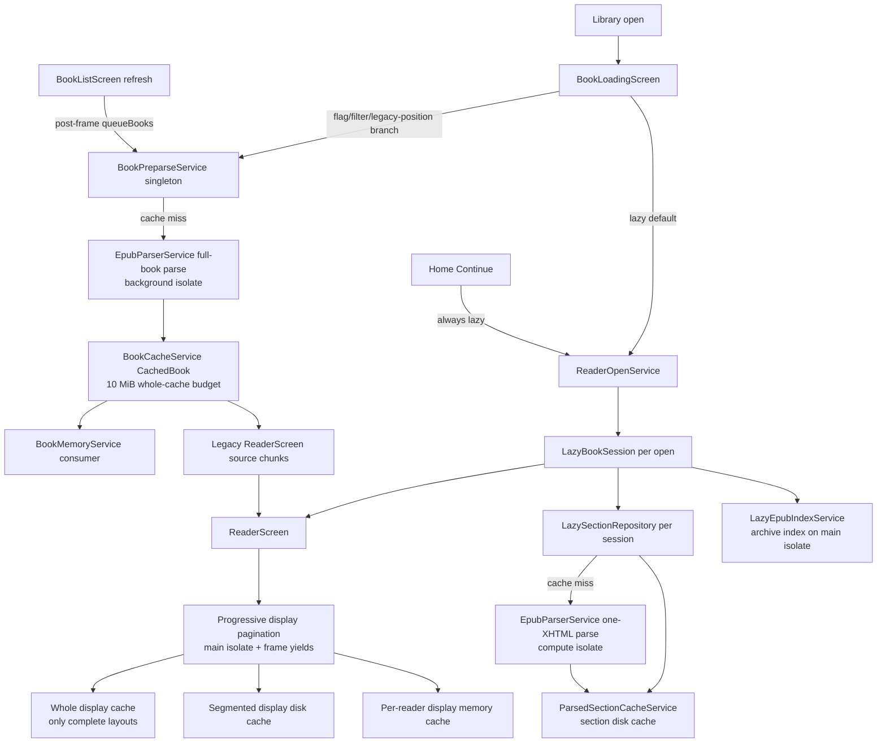
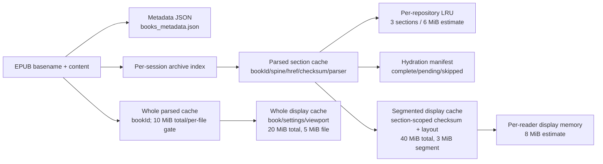

# Nalori EPUB Parsing System Audit

Audit date: 2026-07-10  
Scope: current working tree, including pre-existing uncommitted changes. This is a static code and existing-test audit; no production code or tests were modified.

## 1. Executive Summary

### Direct answers

| Question | Conclusion | Classification |
|---|---|---|
| Can multiple parsing operations run for the same book? | Yes. One `LazySectionRepository` joins duplicate requests for the same spine index, and the singleton `BookPreparseService` joins whole-book requests by filename. Those protections do not cross lazy-session/repository instances and do not cross the lazy and whole-book pipelines. A closed session also does not cancel a section parse already inside `compute`. | **Confirmed** |
| Can parsing continue after leaving the reader? | Yes, in bounded but important ways. Reader pagination stops cooperatively at scheduler checkpoints; lazy section parsing, parsed-cache serialization/writes, and a whole-book preparse already underway are not actually cancelled by route disposal. Their UI results are ignored, but computation/cache persistence can finish. | **Confirmed** |
| Is legacy parsing still active? | Yes. Whole-library `BookPreparseService` work is initiated during every completed library refresh even when lazy reading is enabled. The same whole-book parser is also the foreground reader path when lazy reading is disabled/filtered or a library-opened book has only a legacy saved index. | **Confirmed** |
| Is there an automatic lazy-to-legacy fallback? | No. Lazy-open failure is shown as an error. The per-book disable preference exists, but production code only reads it; only tests call `disableForBook`/`enableForBook`. | **Not supported by evidence** |
| Are repeated queue logs necessarily repeated parsing? | No. `queueBooks` logs every accepted submission. Processing may do a cache hit, join an in-flight whole parse, or start a parse. However, an oversized result that cannot enter `BookCacheService` is reparsed on every later pass. | **Confirmed** |
| Does reopening reuse work? | It creates a new lazy session and reopens the archive. It reuses completed parsed-section and segmented-display disk caches, but it cannot join unfinished work owned by the prior session. | **Confirmed** |

### Highest-risk areas

1. **Oversized whole-book results are reparsed indefinitely.** `BookPreparseService` has no completion marker independent of `BookCacheService`. `cacheBook` silently returns when the compressed serialized result exceeds 10 MiB, while the caller still returns success and later logs `preparse completed` ([book_cache_service.dart](../lib/services/book_cache_service.dart), `BookCacheService.cacheBook`, lines 213-283; [book_preparse_service.dart](../lib/services/book_preparse_service.dart), `_parseAndCache` and `_processQueue`, lines 281-285 and 361-397). For the reported 14,937,510-byte result, the excess is 4,451,750 bytes, or 42.45% above the 10,485,760-byte limit. The next refresh has no manifest entry and performs the full parse again.
2. **Whole-library preparsing is a normal lazy-reader companion, not dormant legacy code.** `_refreshLibrary` posts `queueBooks(validBooks)`, and `_openBook` calls `_refreshLibrary` after the reader/loading routes return ([book_list_screen.dart](../lib/screens/book_list_screen.dart), lines 95-169 and 317-335). This explains repeated queue submissions on return to the list.
3. **Cancellation is often result cancellation, not computational cancellation.** `cancelQueue` only clears waiting items. `LazySectionRepository.close` clears maps and closes the archive but cannot stop a launched `compute` or its subsequent disk write. Display work is better: the frame-budget scheduler checks cancellation repeatedly, but a synchronous `TextPainter`/split interval runs until the next checkpoint ([book_preparse_service.dart](../lib/services/book_preparse_service.dart), lines 179-183 and 254-297; [lazy_section_repository.dart](../lib/services/lazy_section_repository.dart), lines 149-169, 172-245, 316-327; [frame_budgeted_range_scheduler.dart](../lib/services/frame_budgeted_range_scheduler.dart), lines 140-193).
4. **Deduplication is instance-scoped.** Every `LazyBookSession` constructs a repository by default; every reader state constructs its own `DisplayGenerationCoordinator`, memory cache, scheduler, and segmented-cache service. Two sessions/screens can parse or paginate the same content concurrently and use independent write queues against the same disk paths ([lazy_book_session.dart](../lib/services/lazy_book_session.dart), lines 33-40; [reader_screen.dart](../lib/screens/reader_screen.dart), lines 591-700; [parsed_section_cache_service.dart](../lib/services/parsed_section_cache_service.dart), lines 275-284; [segmented_display_cache_service.dart](../lib/services/segmented_display_cache_service.dart), lines 273-294).
5. **Route selection is inconsistent.** Library opens honor lazy flags and the per-book marker, but Home Continue and the diagnostic launcher use `ReaderScreen.directContinue`, which always calls `ReaderOpenService.openLazy` ([book_loading_screen.dart](../lib/screens/book_loading_screen.dart), lines 17-27 and 76-151; [home_screen.dart](../lib/screens/home_screen.dart), lines 134-175; [reader_screen.dart](../lib/screens/reader_screen.dart), lines 156-177 and 1753-1823).

Confirmed safe mechanisms include same-repository section joins, same-screen identical display-generation joins, cooperative pagination cancellation, stale display-write guards, parsed-section checksum/version validation, temporary-file-plus-rename persistence for lazy caches, and resumable hydration manifests. These mechanisms are useful but narrower than application-wide deduplication.

## 2. Terminology

- **EPUB extraction/indexing:** Reading the ZIP/container/package/manifest/spine/navigation metadata. The lazy path calls `EpubReader.openBook` and retains an `EpubBookRef`; the eager path calls `EpubReader.readBook` and materializes a full `EpubBook` ([lazy_epub_index_service.dart](../lib/services/lazy_epub_index_service.dart), `openBookIndex`, lines 241-343; [epub_parser.dart](../lib/services/epub_parser.dart), `_parseBytes`, lines 414-431).
- **Parsing:** Converting XHTML DOM content into `BookChunk`s, anchors, chapters, links, styles, images, and footnotes. The same `EpubParserService._extractContent` implementation is used for a full book and for a synthetic one-XHTML `EpubBook` in `parseLazySection` ([epub_parser.dart](../lib/services/epub_parser.dart), lines 302-372 and 574-1352).
- **Source chunking:** Parser output, normally paragraph-sized `BookChunk`s. Source indexes are stable only inside the relevant whole book or current lazy window; lazy positions add spine/href/checksum identity.
- **Display chunking/pagination:** Measuring source chunks with Flutter `TextPainter`, splitting/merging them to fit the current viewport and typography, and building source-to-display maps. It is main-isolate, frame-yielded work in `ReaderScreen._rebuildDisplayChunks` ([reader_screen.dart](../lib/screens/reader_screen.dart), lines 2787-3058 and 3758-3998).
- **Hydration:** Quiet-time traversal of readable spine sections to populate the parsed-section disk cache. It does not hydrate display pagination ([lazy_section_repository.dart](../lib/services/lazy_section_repository.dart), lines 262-314).
- **Warmup/prefetch:** Loading previous/next lazy sections and, where needed, preparing their display ranges. Initial and stable-location warmup are detached tasks owned logically by `ReaderScreen` ([reader_screen.dart](../lib/screens/reader_screen.dart), lines 5098-5198 and 5931-5949).
- **Lazy session:** A per-open `LazyBookSession` plus a per-session `LazySectionRepository`, open archive handle, loaded section window, pins, and retained LRU.
- **Legacy parser/path:** In this audit, the eager whole-book `EpubParserService.parseFileInBackground` plus `CachedBook`/`BookCacheService` path. It remains both a background library optimizer and an alternate foreground reader route.
- **Cache reuse:** Returning completed, compatible disk or memory data. It is different from joining an unfinished future. Reopening can reuse disk caches but does not join the old session's future.
- **Cancellation:** The audit distinguishes (a) UI/result suppression, (b) cooperative work cancellation at checkpoints, and (c) true cancellation of an isolate/I/O operation. Most Nalori cancellation is (a) or (b), not (c).

## 3. System Architecture

The current application has two independent content pipelines and two display-cache forms. Lazy reading is the default foreground reader. In parallel, the library proactively runs the eager whole-book pipeline for every library book. Those pipelines share `EpubParserService` extraction logic but not in-flight maps, sessions, or cache formats.



Important ownership boundaries:

- `BookPreparseService.instance` and `BookCacheService()` are application-wide singletons ([book_preparse_service.dart](../lib/services/book_preparse_service.dart), lines 84-100; [book_cache_service.dart](../lib/services/book_cache_service.dart), lines 103-133).
- `LazyBookSession`, `LazySectionRepository`, their in-flight section map, and retained sections are per open/session ([lazy_book_session.dart](../lib/services/lazy_book_session.dart), lines 33-40; [lazy_section_repository.dart](../lib/services/lazy_section_repository.dart), lines 47-67).
- Display generation, range scheduling, memory cache, and the default segmented-cache service object are per `ReaderScreen` state ([reader_screen.dart](../lib/screens/reader_screen.dart), lines 663-704 and 4270-4275).
- The lazy parsed and segmented files are application-persistent even though the service objects are per session/screen.

## 4. User-Action Lifecycle Traces

### First-time book open

1. Import copies the EPUB using its basename and refuses replacement if that name already exists ([book_import_service.dart](../lib/services/book_import_service.dart), lines 67-85).
2. Library refresh creates missing metadata by opening a lazy EPUB index and optional cover, then closes the handle ([book_list_screen.dart](../lib/screens/book_list_screen.dart), lines 95-148; [book_metadata_service.dart](../lib/services/book_metadata_service.dart), lines 103-161).
3. After the list frame, `_refreshLibrary` submits all valid books to the singleton preparse queue ([book_list_screen.dart](../lib/screens/book_list_screen.dart), lines 153-168).
4. A tap calls `_openBook`: it clears only waiting preparse entries, raises foreground pressure for the entire loading/reader route lifetime, and pushes `BookLoadingScreen` ([book_list_screen.dart](../lib/screens/book_list_screen.dart), lines 317-335).
5. With default `NALORI_ENABLE_LAZY_READER=true`, empty `NALORI_LAZY_READER_ONLY_BOOK`, no per-book marker, and no legacy-only saved-position condition, `ReaderOpenService.openLazy` creates a new session, opens the index, resolves a stable target, and parses/loads one section (`after: 0`) ([book_loading_screen.dart](../lib/screens/book_loading_screen.dart), lines 21-27 and 120-162; [reader_open_service.dart](../lib/services/reader_open_service.dart), lines 77-174).
6. The reader builds an initial bounded display range (48 source chunks in lazy mode where available), writes segmented cache data, then schedules adjacent warmup and later hydration ([reader_screen.dart](../lib/screens/reader_screen.dart), lines 4000-4244, 5098-5198, and 5952-5977).
7. Any whole-book preparse already running before the tap continues. Waiting queue items are removed.

### Reopening a cached book

- A new `LazyBookSession` and archive handle are always created; there is no session registry or reuse ([reader_open_service.dart](../lib/services/reader_open_service.dart), lines 87-109).
- The archive bytes and package index are reread. Parsed sections hit `ParsedSectionCacheService`, deserialize in an isolate, and enter the new repository LRU ([lazy_epub_index_service.dart](../lib/services/lazy_epub_index_service.dart), lines 241-248; [lazy_section_repository.dart](../lib/services/lazy_section_repository.dart), lines 172-195; [parsed_section_cache_service.dart](../lib/services/parsed_section_cache_service.dart), lines 377-428).
- Display loading first checks the whole display cache, then the segmented display cache around the target; missing ranges are regenerated ([reader_screen.dart](../lib/screens/reader_screen.dart), lines 2147-2245 and 4000-4095).
- Unfinished work from the prior session is not joined. If it has not yet committed its parsed-section record, the new repository can parse the same section again.

### Continue-reading route

`HomeScreen._resumeReading` uses `_resumeOpening` to prevent duplicate taps, then pushes `ReaderScreen.directContinue` ([home_screen.dart](../lib/screens/home_screen.dart), lines 134-175). The reader constructs a `ReaderOpenOperation` and calls `openLazy` directly ([reader_screen.dart](../lib/screens/reader_screen.dart), lines 1753-1823). This route:

- does not consult `NALORI_ENABLE_LAZY_READER`, `NALORI_LAZY_READER_ONLY_BOOK`, or `LazyReaderRouteService`;
- permits approximate migration from a legacy index using `legacyLastReadIndex / (totalChunks - 1)` ([reader_open_service.dart](../lib/services/reader_open_service.dart), lines 218-246);
- cancels the operation flag on dispose, but the flag is checked only between major awaits; it cannot terminate archive/index work or a launched section `compute`.

### Leaving during initial loading

`BookLoadingScreen.dispose` disposes only its animation controller; it has no `ReaderOpenOperation` ([book_loading_screen.dart](../lib/screens/book_loading_screen.dart), lines 85-101). If popped:

- lazy open continues through index/section work; after it returns, the `!mounted` branch closes the completed session ([book_loading_screen.dart](../lib/screens/book_loading_screen.dart), lines 153-167);
- legacy `ensureParsed` continues through full parse and cache attempt, then `_loadLegacy` ignores the result at its `mounted` check ([book_loading_screen.dart](../lib/screens/book_loading_screen.dart), lines 215-250);
- stale UI state is guarded, but computational work is not cancelled.

### Leaving while adjacent warmup is running

Reader disposal clears UI/session state and starts `session.close` without awaiting it ([reader_screen.dart](../lib/screens/reader_screen.dart), lines 905-944). Warmup checks `mounted` before integration, so it does not publish to the dead widget. The repository's already-launched section parse and `writeSection` continue; `_canRetainResult` prevents old results from reentering the closed repository, but the persistent cache write occurs before that check ([lazy_section_repository.dart](../lib/services/lazy_section_repository.dart), lines 217-244 and 316-331).

### Reopening immediately after leaving

The old reader's cooperative display task is cancelled at its next scheduler checkpoint. Its lazy section `compute` may continue. The new reader creates a new session/repository and checks disk independently. Therefore:

- if the old write has committed, the new session gets a cache hit;
- if not, both repositories may parse the same section;
- their per-instance `ParsedSectionCacheService._writeQueue`s do not coordinate, so they may target the same `.tmp`, payload, and manifest paths.

### Switching to another book

There is no direct reader-to-reader route. Normal switching is reader pop -> loading route pop -> `_openBook` completion -> `_refreshLibrary` -> whole-library queue -> another tap. The refresh can start a background whole parse during the interval; the next tap cancels waiting work but not that running parse. Thus an unrelated full-book parse can overlap the new book's lazy index/section parsing and main-isolate pagination.

### Changing reader settings

Layout-affecting settings are font size/family/weight, content density, line height, paragraph spacing, side margin, and card depth ([reader_screen.dart](../lib/screens/reader_screen.dart), lines 438-450). `_handleSettingsUpdate` saves a position anchor and starts a 300 ms debounce; the callback nulls viewport memoization so the next build requests a new display generation ([reader_screen.dart](../lib/screens/reader_screen.dart), lines 9523-9622). The coordinator cancels the old token when the signature differs. Pagination cancellation is cooperative; serialization/write phases recheck the stale token.

### Lazy-reader fallback or disablement

- Library route: legacy when the per-book marker is present, the compile-time lazy flag is false, `NALORI_LAZY_READER_ONLY_BOOK` selects another filename, or a book has `lastReadIndex > 0` but no stable location ([book_loading_screen.dart](../lib/screens/book_loading_screen.dart), lines 76-82 and 120-150).
- Home Continue/diagnostic launcher: always lazy ([home_screen.dart](../lib/screens/home_screen.dart), lines 163-171; [main.dart](../lib/main.dart), lines 88-121).
- Lazy failure: error UI, not automatic legacy fallback ([book_loading_screen.dart](../lib/screens/book_loading_screen.dart), lines 153-212; [reader_screen.dart](../lib/screens/reader_screen.dart), lines 1790-1817 and 1905-1971).
- No production caller writes the per-book disable list; only its unit test calls `disableForBook` and `enableForBook` ([lazy_reader_route_service.dart](../lib/services/lazy_reader_route_service.dart), lines 3-28; [lazy_reader_route_service_test.dart](../test/unit/services/lazy_reader_route_service_test.dart), lines 10-27).

## 5. Parsing Pipeline Inventory

| Pipeline | Entry Point | Trigger | Lazy/Legacy | Main Isolate/Background | Duplicate Protection | Cancellation | Current Reachability |
|---|---|---|---|---|---|---|---|
| Metadata/index/cover extraction | `BookMetadataService.extractAndCacheMetadata` | New library file without metadata | Lazy index, metadata-only | File/archive/index and cover reads on main isolate | None across refreshes; singleton metadata prevents repeat after successful save | None; awaited by refresh | Normal first discovery/import |
| Whole-library preparse | `BookListScreen._refreshLibrary -> queueBooks` | Initial list, return from reader, import/delete/details/cover/reset and other refresh callers | Legacy eager optimizer | File read main async; full parse and cache serialization in `Isolate.run` | Singleton queue set, `_inFlightParses[bookId]`, serial `_parseTail`; no durable completion outside whole cache | Waiting queue only; running parse not cancelled | Normal, even with lazy reader |
| Foreground legacy reader parse | `BookLoadingScreen._loadLegacy -> ensureParsed` | Lazy disabled/filtered/per-book marker or legacy saved position | Legacy eager reader | Same as whole preparse | Joins singleton whole-book future by basename | Route pop does not cancel parse | Alternate normal path |
| Lazy archive index | `ReaderOpenService.openLazy -> LazyBookSession.open` | Lazy library open or direct Continue | Lazy | `EpubReader.openBook` invoked on main isolate after full file byte read | None across sessions | Operation flag checked after completion; handle later closed | Default foreground path |
| Lazy section parse | `LazySectionRepository.loadSectionWithPriority` | Initial target, navigation, warmup, hydration | Lazy | Resource reads main; DOM parse in `compute` isolate | `_inFlight[spineIndex]` within one repository only; retained LRU and disk cache | No isolate cancellation; epoch blocks retention only | Default foreground/background reader work |
| Adjacent warmup/prefetch | Reader `_scheduleLazyAdjacentWarmup` / boundary methods | First visible frame, stable navigation, page boundary | Lazy | Section parse as above; display work main | Per-direction `_activeLazyAdjacentLoads` plus repository join | Mounted/generation guards; current parse persists | Normal lazy path |
| Parsed hydration | `hydrateParsedSectionsFromCurrent` | After 900 ms quiet period following warmup | Lazy eager-fill optimization | Each section parse in `compute`; manifest I/O main; serialization isolate | Same repository section join plus hydration manifest completed indexes | Pauses only between sections; current section persists | Normal lazy path |
| Display pagination | `ReaderScreen._ensureDisplayChunksBuilt` | First layout, viewport/layout change, lazy window replacement | Shared by both reader paths | Main isolate, cooperatively frame-yielded | Per-reader generation signature; per-reader active range; memory/segmented caches | Cooperative at checkpoints; stale publish/write guards | Normal reader path |
| Whole display cache hydration | `BookCacheService.loadDisplayChunks` | Every display generation before rebuild | Compatibility/current small-complete layouts | File I/O main async; deserialize isolate | No in-flight load map | Result ignored if stale | Reachable |
| Segmented display hydration | `_loadProgressiveSegmentsAroundSource` / `_loadCachedProgressiveDisplayRange` | Whole display miss, range request | Current progressive reader | File I/O main async; deserialize isolate | No cross-screen in-flight map | Result ignored if generation stale | Normal current path |
| Book-memory legacy-cache use | `BookMemoryService.load` | Open Book Memory | Legacy compatibility consumer | Cache deserialize isolate; occurrence scanning main | Reuses whole cache only; does not start parse | N/A | Normal feature consumer |
| Asset/local direct parser APIs | `EpubParserService.loadAndParse`, `loadAndParseFromFile` | Tests/diagnostic tool | Legacy eager | Caller isolate (no automatic background for these methods) | None | None | Tests/tooling, not production UI |

## 6. Call Graphs

### Library open, lazy branch

```text
Book card tap
  -> BookListScreen._openBook (lib/screens/book_list_screen.dart:317)
  -> BookPreparseService.cancelQueue + beginForegroundWork
  -> Navigator.push(BookLoadingScreen)
  -> BookLoadingScreen._loadAndParse (lib/screens/book_loading_screen.dart:103)
  -> ReaderOpenService.openLazy (lib/services/reader_open_service.dart:77)
  -> new LazyBookSession -> LazySectionRepository.open
  -> LazyEpubIndexService.openBookIndex
  -> LazyBookSession.loadAround(after: 0)
  -> LazySectionRepository.loadSectionWithPriority
     -> ParsedSectionCacheService.loadSection
     -> miss: archive section/resource reads
     -> compute(_parseSectionPayload)
     -> EpubParserService.parseLazySection
     -> ParsedSectionCacheService.writeSection
  -> Navigator.push(ReaderScreen with transferred session)
  -> ReaderScreen._ensureDisplayChunksBuilt
     -> BookCacheService.loadDisplayChunks
     -> SegmentedDisplayCacheService load, or progressive main-isolate pagination
     -> segmented cache write
  -> adjacent warmup -> hydration
```

### Library refresh and eager background branch

```text
BookListScreen.initState / _openBook return / import/delete/details action
  -> BookListScreen._refreshLibrary (book_list_screen.dart:95)
  -> post-frame BookPreparseService.instance.queueBooks(validBooks) (:161-168)
  -> queue replacement + "preparse queued" per accepted filename
  -> _processQueue
  -> ensureParsed(background)
  -> file.stat + BookCacheService.hasCachedBook
     -> hit: loadCachedBook (read + isolate deserialize + manifest write)
     -> miss: singleton _inFlight check
       -> serial _parseTail
       -> EpubParserService.parseFileInBackground
       -> full EpubReader.readBook + XHTML extraction in isolate
       -> BookCacheService.cacheBook
       -> "preparse completed" whether cacheBook stored or skipped for size
```

### Route exit sequence

```mermaid
sequenceDiagram
  participant U as User
  participant R as ReaderScreen
  participant S as LazyBookSession/Repository
  participant P as Section compute/cache write
  participant L as BookLoadingScreen
  participant B as BookListScreen
  participant Q as BookPreparseService

  U->>R: Back / pop
  R->>R: cancel display token; dispose scheduler/timers
  R-->>S: unawaited close()
  Note over P: Already launched compute/write is not cancelled
  R-->>L: reader route completes
  L-->>B: loading route pops
  B->>Q: end foreground work
  B->>B: _refreshLibrary()
  B->>Q: post-frame queueBooks(all valid books)
```

### Display generation state

`_ensureDisplayChunksBuilt` computes a signature containing book ID, static parsed/layout versions, settings, viewport, and the whole display key ([reader_screen.dart](../lib/screens/reader_screen.dart), lines 2023-2092). `DisplayGenerationCoordinator.request` then:

- joins only if its own active token has an equal signature;
- cancels that token and increments `_nextId` for a different signature;
- starts a new token if the prior one was completed or explicitly cancelled ([display_generation_coordinator.dart](../lib/services/display_generation_coordinator.dart), lines 101-138).

Lazy target-window replacement and the non-incremental backward prepend explicitly cancel the active token, clear display state, and reset viewport memoization. The next build can therefore start generation 2 or 3 with the same base display cache key because source-window identity is not part of that base key ([reader_screen.dart](../lib/screens/reader_screen.dart), lines 5547-5590 and 5844-5888).

## 7. Ownership and Lifecycle Matrix

| Object or Task | Created By | Scope | Stored Where | Disposed By | Survives Route Pop? | Can Hold Book Data? | Risk |
|---|---|---|---|---|---|---|---|
| `BookPreparseService.instance` | Static initializer | App-wide | Static singleton | Never; queue cleared by screens | Yes | In-flight `CachedBook` future, queued files | High: active work outlives screens |
| `_parseTail` | Preparse singleton | App-wide serial chain | Service field | Never | Yes until task completes | Captured parse result/task | Expected persistence; no active cancellation |
| `BookCacheService` | Static singleton factory | App-wide | Static singleton | Never | Yes | Manifests, serialized data transiently | Medium: concurrent display writers uncoordinated |
| `BookLoadingScreen._loadAndParse` | `initState` | Loading route | Unstored future | No operation cancellation | Yes after pop until await finishes | File, metadata, result/session | Medium waste; stale UI guarded |
| `LazyBookSession` | Each `openLazy` | Per book open | Loading result then reader state | Reader `dispose`, unawaited | Close begins, in-flight work may survive | Index and loaded sections | High under rapid reopen |
| `LazyEpubBookHandle` | Repository `open` | Per session | Repository `_handle` | Repository `close` | No intended retention | Archive and content refs | Close can race old readers |
| Repository retained LRU | Repository | Per session/book | `_retained`, max 3 / 6 MiB estimate | `close` | No | Parsed sections/images | Safe; pins may temporarily exceed budget |
| Repository `_inFlight` | Section request | Per repository | Map keyed only by spine index | Removed on completion; cleared on close | Task can survive map clearing | XHTML/resources/result | High: no cross-session join/cancel |
| Parsed-section disk write queue | Each cache service | Per repository instance | `_writeQueue` | Never explicitly | Yes until writes finish | Serialized section | High cross-instance race potential |
| Hydration loop | Reader/session | Per reader | Detached future | Mounted/session/epoch checks | Current section can finish | Sections progressively | Medium/expected cache work |
| `DisplayGenerationCoordinator` | Reader state | Per reader | State field | `cancelActive` in dispose | Token no; underlying sync interval briefly yes | Signature only | Safe scope, not global dedup |
| `FrameBudgetedRangeScheduler` | Reader `initState` | Per reader | State field | Reader `dispose` | Only until next checkpoint | Temporary display lists | Low/medium bounded latency |
| Display memory cache | Reader state | Per reader, 8 MiB estimate | State field | Cleared on dispose/window replace | No | Display chunks/images | Safe |
| Segmented cache service/write queue | Lazily per reader | Per reader object, shared disk | State field | Not disposed | Writes can finish | Serialized display ranges | Medium cross-screen collision risk |
| Timers/listeners | Reader/ReadingCard | Per widget | Widget fields | Explicitly cancelled/removed | No intended | Small UI state | Confirmed safe for parsing lifecycle |
| Metadata/cache singletons | Services | App-wide | Static/in-memory | Process termination | Yes | Metadata/manifests | Expected |

## 8. Duplicate Parsing and Concurrency Analysis

### Same section requested twice in one session

Confirmed safe against duplicate parsing. `LazyBookSession` first checks `_loadedSections`; the repository checks retained memory, then `_inFlight[spineIndex]`. A second request returns the exact active future and may promote its priority ([lazy_book_session.dart](../lib/services/lazy_book_session.dart), lines 122-137; [lazy_section_repository.dart](../lib/services/lazy_section_repository.dart), lines 97-140). The existing test verifies object identity for two priorities ([lazy_section_repository_test.dart](../test/unit/services/lazy_section_repository_test.dart), lines 48-72).

The key is only `spineIndex`, which is correct while one repository holds exactly one book handle. Entries are removed in `whenComplete`. Failures remove the entry and a later request retries.

### Same section requested from two sessions

Duplicate parsing is possible. Each default session creates a new repository and new parsed-cache service. No static/global in-flight registry exists. Both can observe a disk miss and launch `compute` for the same `(bookId, spineIndex, href, sourceChecksum, parserVersion)`. Close of the first repository clears its map but does not stop its task, increasing the immediate-reopen window.

### Same book opened twice

- Home Continue blocks repeated taps with `_resumeOpening` ([home_screen.dart](../lib/screens/home_screen.dart), lines 134-136 and 173-175).
- `BookListScreen._openBook` has no equivalent opening flag ([book_list_screen.dart](../lib/screens/book_list_screen.dart), lines 317-335). Normal navigation makes a second physical tap unlikely after the route covers the list, but no model/service invariant prevents two calls or two reader routes.
- Every successful call creates a session. There is no per-book session registry.
- `BookPreparseService._foregroundBookIds` is a set, not reference-counted. Two lazy opens of the same book can both suppress it; the first `resumeBackgroundBook` removes the shared marker while the second may still be opening ([book_preparse_service.dart](../lib/services/book_preparse_service.dart), lines 104-124).

### Lazy parsing versus hydration

Within one repository, navigation and hydration join by spine index and navigation promotes priority. Hydration itself is sequential and checks the manifest before each section ([lazy_section_repository.dart](../lib/services/lazy_section_repository.dart), lines 121-139 and 262-314). Across sessions, there is no join. Hydration completion is updated when a section record is committed, so interrupted hydration resumes from completed records.

### Lazy parsing versus legacy parsing

They are completely separate deduplication domains and cache formats:

- eager: `BookPreparseService._inFlightParses[bookId]` -> `CachedBook` whole-file cache;
- lazy: repository `_inFlight[spineIndex]` -> parsed-section cache.

A running eager parse is not stopped by `cancelQueue`, and `ReaderOpenService` does not query or join it. The same XHTML can therefore be parsed once inside the full-book isolate and again as a lazy section. The full `EpubParser` logs many HTML entries; the lazy synthetic book logs one entry because `parseLazySection` creates `EpubContent.Html` containing only the requested XHTML ([epub_parser.dart](../lib/services/epub_parser.dart), lines 302-341 and 595-608).

### Pagination with different layouts

Layout-affecting dimensions are represented in `BookCacheService.displayChunkKey` and the generation signature ([book_cache_service.dart](../lib/services/book_cache_service.dart), lines 319-349). Different settings/viewport values intentionally create different work/cache entries. Within one screen, the old generation is made stale. Across screens, identical or different layouts can run concurrently because coordinators and schedulers are per screen.

### Identical cache key across generations

Yes, sequential or overlapping rebuilds are possible:

- Explicit lazy window replacement cancels the current token without changing font/viewport key, then the next build starts a higher token ID.
- If the prior range is still between checkpoints, it overlaps briefly with the replacement.
- The debug message `identical generation in flight, joining` proves only that one coordinator returned its active token. It does not represent a shared future and does not join another reader.
- `cancelled after rebuild` is logged after `_rebuildDisplayChunks` returns and the caller finds the token stale ([reader_screen.dart](../lib/screens/reader_screen.dart), lines 2677-2737). It does **not** prove that every source chunk was paginated: `_rebuildDisplayChunks` can return a cancelled range after a scheduler checkpoint. It does prove that potentially expensive work ran between the pre-check and post-check. If cancellation lands after the last checkpoint, most or all of that range may have been computed and discarded.

### Cache write races

- Parsed and segmented cache writes are serialized only within one service instance (`_writeQueue` fields). Multiple sessions/readers have separate queues.
- Parsed writers use the same section `.tmp` and manifest `.tmp`; segmented writers use the same range filename and manifest `.tmp`. Concurrent instances can overwrite/delete each other's temporary file or load the same old manifest and publish a lost update ([parsed_section_cache_service.dart](../lib/services/parsed_section_cache_service.dart), lines 431-495 and 529-554; [segmented_display_cache_service.dart](../lib/services/segmented_display_cache_service.dart), lines 613-775 and 819-850).
- Whole `BookCacheService` files/manifests are direct writes, not temporary rename writes ([book_cache_service.dart](../lib/services/book_cache_service.dart), lines 257-271 and 692-722). The singleton preparse tail serializes whole-book writes, but two reader screens can concurrently load/write display state through the same singleton.
- Stale-generation callbacks substantially reduce incorrect display writes, but they do not provide a cross-instance file lock.

### Failure, retry, exit, and immediate reopen

Failures remove in-flight entries, allowing retry. This is correct, but after `close` the old task is no longer represented in `_inFlight`, so a new session cannot distinguish “old computation still running” from “no work.” The disk cache is the only cross-session rendezvous, and it is effective only after commit.

## 9. Reader Exit Behaviour

### Widget disposal

The reader immediately removes its lifecycle observer, cancels its direct-open flag, cancels the active display token, increments generation counters, disposes the range scheduler, clears display memory, cancels timers, removes the native handler, flushes persistence asynchronously, disposes controllers/notifiers, and starts session close ([reader_screen.dart](../lib/screens/reader_screen.dart), lines 905-944). There is no `PopScope`; normal Navigator back pops the route and invokes this disposal.

### Session and repository

`LazyBookSession.close` clears loaded sections/location/index and awaits repository close. Repository close increments an epoch, clears retained/pinned/in-flight maps, detaches the handle, and closes archive entries ([lazy_book_session.dart](../lib/services/lazy_book_session.dart), lines 348-354; [lazy_section_repository.dart](../lib/services/lazy_section_repository.dart), lines 316-327). Because the reader does not await `close`, cleanup overlaps route transition.

### Parsing

- A lazy `compute` already launched continues. Its result can still be serialized and written. Epoch/handle identity prevents only memory retention.
- A whole preparse already launched continues. `cancelQueue` has no task/isolate handle.
- Direct-open and loading futures ignore/close results after disposal but do not terminate the underlying phase.

### Pagination

The scheduler is genuinely cancelled, but cooperatively. Each `checkpoint` checks scheduler and external generation/mounted state. Synchronous DOM-independent text measurement or split logic between checkpoints continues briefly. Published state is prevented after disposal.

### Hydration and prefetch

Detached loops check `mounted`/session identity before starting another section or integrating a result. A current section load is not cancelled. Hydration's `shouldPause` stops at section boundaries; it does not include app lifecycle state, only widget/session/foreground reader work ([reader_screen.dart](../lib/screens/reader_screen.dart), lines 5959-5977).

### Cache writes

Parsed-section writes intentionally may finish after exit and are reusable. Segmented display writes consult the current generation token at several stages and reject/delete stale data. Serialization already started can still finish before that check. Whole display cache similarly checks `shouldWrite` before/after serialization and after file write ([book_cache_service.dart](../lib/services/book_cache_service.dart), lines 390-468).

### Isolates and global services

There is no retained `Isolate` handle to kill. `Isolate.run`/`compute` isolates end when their closure completes. The preparse and whole cache singletons live until process termination. App backgrounding does not stop parsing or pagination: `didChangeAppLifecycleState` pauses reading timers/speed read and flushes persistence, but does not cancel display, lazy repository, hydration, or preparse work ([reader_screen.dart](../lib/screens/reader_screen.dart), lines 946-975). Process termination stops everything; lazy/segmented temporary files are cleaned next initialization, while whole cache corruption is handled on a later load.

### Returning to the list

For a library-opened book, the route stack is list -> loading -> reader. Reader pop disposes reader; the loading future resumes and pops itself; `_openBook` ends its foreground pressure and calls `_refreshLibrary`, which queues all books again. There is no route observer or app-resume callback responsible for the repeated queue; it is the explicit post-await refresh.

## 10. Legacy Parser Reachability

| Component | Classification | Evidence |
|---|---|---|
| `BookPreparseService` whole-library queue | **Actively used in normal flow** | `_refreshLibrary` always posts `queueBooks(validBooks)` unless `initiallyOpenFile` is set ([book_list_screen.dart](../lib/screens/book_list_screen.dart), lines 153-168). |
| `EpubParserService.parseFileInBackground` | **Actively used in normal flow** | Default `_parseFile` of the singleton preparse service ([book_preparse_service.dart](../lib/services/book_preparse_service.dart), lines 60-69). |
| `BookLoadingScreen._loadLegacy` | **Used when lazy reader is disabled/filtered or legacy position requires migration** | Branch at lines 120-150; it calls `ensureParsed` at lines 215-224. |
| `CachedBook` / whole parsed cache | **Active compatibility/feature cache** | Written by preparse; consumed by legacy reader and `BookMemoryService.load` ([book_memory_service.dart](../lib/services/book_memory_service.dart), lines 26-68). |
| Whole display cache | **Reachable compatibility/current small-complete cache** | Reader always checks it; complete initial layouts may write it ([reader_screen.dart](../lib/screens/reader_screen.dart), lines 2184-2225 and 2752-2784). Large progressive layouts primarily use segments. |
| Per-book lazy disable service | **Read in production; writes only tests/tooling** | `BookLoadingScreen` calls `isDisabledForBook`; no production reference to `disableForBook` or `enableForBook`. |
| Automatic fallback after lazy failure | **Confirmed absent** | Both lazy callers surface an error; neither calls `_loadLegacy`. |
| `EpubParserService.loadAndParse` | **Tests/tooling/dormant in production UI** | No production call site; `loadAndParseFromFile` is used in parser tests and the diagnostic tool. |
| `buildSearchIndexInBackground` | **Dormant but compiled** | Defined at [epub_parser.dart](../lib/services/epub_parser.dart), lines 1355-1378; no production caller found. Lazy windows construct their search index directly. |

The lazy reader default is compile-time `true`; no runtime remote flag exists. Legacy reading remains reachable through flags and migration, and legacy full-book preprocessing remains reachable regardless of those flags. Both old and new parsing can run in one application session and, when a queued parse was already active, at the same time.

## 11. Background Work Inventory

| Background Task | Starts When | Ownership | Deduplication | Cancellation | Continues After Exit? | Intended? | Risk |
|---|---|---|---|---|---|---|---|
| Whole-library queue processor | Library refresh post-frame | App singleton | Queue set/in-flight by book ID; serial tail | `cancelQueue` waiting only | Running item yes | Retained optimization | High for oversized books |
| Whole EPUB parse | Whole cache miss | Preparse singleton | Per-book singleton future | None | Yes | Cache building | High resource waste when uncacheable |
| Whole-cache serialize/write | After full parse | BookCache singleton | Serial indirectly via parse tail | None | Yes | Persistence | Medium |
| Lazy index open | Reader open | Loading/direct future | None | Flag between awaits | Yes until phase ends | Required | Medium on fast exit |
| Lazy section parse | Section miss | Repository task | Per repository/spine | None after `compute` launch | Yes | Required/reusable cache | Medium/high duplicate risk |
| Parsed-section cache write | After section parse | Per-cache queue | Per instance only | None | Yes | Intentional reusable work | Medium cross-instance race |
| Initial adjacent warmup | First display ready | Reader detached future | Per direction + repository | Mounted/gen guards | Current load yes | Intentional | Low/medium |
| Quiet hydration | After warmup/900 ms quiet | Reader/session | Repository + manifest | Between sections | Current load yes | Intentional | Medium due full-book fill |
| Progressive display range | Initial/boundary/navigation | Reader scheduler | One active range policy | Cooperative | Briefly until checkpoint | Required | Low/medium |
| Display range disk write | Successful range | Reader cache service | Per-instance queue | Multi-stage stale callback | Serialization may finish | Intentional | Medium cross-screen race |
| Settings debounce | Layout setting edit | Reader timer | Latest timer wins | Timer cancel/dispose | No | Intentional | Safe |
| Reader persistence | Dispose/background | Global services, fire-and-forget | Service-specific | No | Yes briefly | Intentional | Safe/non-parsing |

## 12. Cache Architecture



### Whole parsed cache

- Key: sanitized book basename; file `book_cache/<key>.json.gz`; manifest entry by raw book ID.
- Validity: EPUB modified time must not be newer than `cachedAtMs`; deserializer enforces format version 4 ([book_cache_service.dart](../lib/services/book_cache_service.dart), lines 109-117 and 152-210).
- Capacity: 10 MiB total, and any single compressed serialized parsed result larger than 10 MiB is rejected.
- Partial state: none. There is no “parsed but intentionally uncached” marker.
- Queue-hit cost: a cached preparse pass does not merely check existence. `ensureParsed` calls `loadCachedBook`, which reads/decompresses/deserializes the entire cache and rewrites its last-access manifest ([book_preparse_service.dart](../lib/services/book_preparse_service.dart), lines 201-223). Repeated queueing therefore has meaningful I/O/CPU even without parsing.
- Atomicity: payload and manifest are direct writes, not temp-renames.

### Lazy parsed-section cache and hydration manifest

- Directory: `book_cache/parsed_sections/<safe bookId>/`.
- Payload key/file: spine index + safe href + source-checksum prefix; record additionally matches full path, full checksum, parser `section_v2`, and `ready` status ([lazy_parsed_book.dart](../lib/services/lazy_parsed_book.dart), lines 13-63; [parsed_section_cache_service.dart](../lib/services/parsed_section_cache_service.dart), lines 64-71 and 377-428).
- Persistence: no byte cap or LRU eviction was found for this disk layer.
- Partial/resume: manifest records represent independent completed sections. Hydration records completed/pending/failed/skipped and is rebuilt from section records ([parsed_section_cache_service.dart](../lib/services/parsed_section_cache_service.dart), lines 580-680).
- Atomicity: payload and manifest use `.tmp` plus rename, and corrupt/missing records are removed. This is robust for one service instance, not coordinated across instances.

### In-memory section cache

- Per repository; insertion-order LRU, default three sections and estimated 6 MiB.
- Current/target/adjacent spine indexes are pinned. If all over-budget entries are pinned, the budget can be exceeded intentionally ([lazy_section_repository.dart](../lib/services/lazy_section_repository.dart), lines 47-80 and 333-385; [lazy_book_session.dart](../lib/services/lazy_book_session.dart), lines 392-410).
- Cleared on close; no route-pop persistence.

### Whole display cache

- Key dimensions: book ID, layout version `v11`, font size/family/weight, density, line/paragraph spacing, side margin, viewport, card-depth flag, text scale, and canonical safe area ([book_cache_service.dart](../lib/services/book_cache_service.dart), lines 319-349).
- Missing dimension: source content checksum/file modification. Parsed format version is encoded indirectly through layout behavior/signature but not in the filename builder. Deleting/replacing a same-named EPUB can leave stale display files.
- Capacity: 20 MiB total, 5 MiB per layout.
- Atomicity: direct payload/manifest writes.

### Segmented display cache

- Persistent capacity: 40 MiB total; 3 MiB per segment.
- Manifest compatibility includes book, cache key, parsed version, layout, settings, viewport, and source chunk count ([segmented_display_cache_service.dart](../lib/services/segmented_display_cache_service.dart), lines 1002-1015).
- Lazy section-scoped keys append spine index and source checksum when a complete single-section range can be identified ([reader_screen.dart](../lib/screens/reader_screen.dart), lines 4297-4373). This protects section-scoped lazy segments from changed XHTML.
- Partial/resume: independent contiguous or separated range records. Loads decode only center/adjacent segments.
- Atomicity: temp payload/manifest rename, checksum validation, stale-generation checks; per-instance queue only.

### Metadata and deletion

Metadata is an application singleton backed by `books_metadata.json`; book identity is the filename/basename ([book_metadata_service.dart](../lib/services/book_metadata_service.dart), lines 15-60; [book_metadata.dart](../lib/models/book_metadata.dart), lines 152-180). Library deletion removes only the EPUB, metadata/cover, user preferences/memory, and `BookCacheService.deleteCachedBook` ([book_list_screen.dart](../lib/screens/book_list_screen.dart), lines 1495-1533). It does not call parsed-section deletion, segmented-display deletion, or whole display deletion. Orphaned lazy/display data therefore persists. Parsed-section checksums mitigate incorrect lazy reuse; same-name legacy whole display data has weaker source invalidation.

## Runtime Log Correlation

The external physical-device terminal log was not supplied. Per the corrected task instructions, runtime-specific event counts, chronological ordering, overlap, and navigation correlation are **not verifiable from the supplied context** and are not invented here. The following is a static mapping of the requested emitters and what each message proves if observed.

### Emitter mapping

| Log Pattern | Source Method | Book | Trigger | New Work or Joined Work | Main/Background Isolate | Continues After Exit? | Static Interpretation |
|---|---|---|---|---|---|---|---|
| `BookPreparseService: preparse queued` | `_log` from `queueBooks`, [book_preparse_service.dart](../lib/services/book_preparse_service.dart), lines 159-176, 399-403 | Logged basename | Every `BookListScreen._refreshLibrary` post-frame call | Submission only | Main isolate | Waiting entry is cleared on open/dispose | Not proof of parsing or cache I/O yet |
| `preparse started` | `_parseAndCache`, lines 361-369 | Logged basename | Cache miss, no singleton in-flight future, parse reaches serial tail | New whole parse | Parser itself background isolate; file read/orchestration main | Yes, once started | Proof of actual whole-book parse invocation |
| `preparse skipped cache hit` | `ensureParsed`, lines 204-223 | Logged basename | Whole cache valid and successfully loaded | Reused completed whole cache | File I/O main async, deserialize isolate | Current load can finish | Includes full cache read/deserialization, not only lookup |
| `BookCacheService: Skipping cache` | `cacheBook`, [book_cache_service.dart](../lib/services/book_cache_service.dart), lines 224-251 | Logged book ID | Compressed serialized `CachedBook` > 10 MiB | Completed computation, no durable whole cache | Serialization isolate | Yes if parse already detached | Guarantees next preparse pass has no new whole-cache entry from this invocation |
| `_ensureDisplayChunksBuilt ... identical generation in flight, joining` | `_ensureDisplayChunksBuilt`, [reader_screen.dart](../lib/screens/reader_screen.dart), lines 2090-2106 | Current reader | Rebuild request while same reader coordinator has equal active signature | No new coordinator token; caller simply returns | Main isolate | Coordinator disposed on pop | Per-reader only; not a cross-screen future join |
| `_loadOrRebuildDisplayChunks start gen=N` | `_loadOrRebuildDisplayChunks`, lines 2147-2184 | Current reader | New coordinator token | New cache-load/rebuild orchestration | Main + deserialize isolate | Stale result ignored | Generation ID is local to one reader state |
| `CACHE MISS -> triggering rebuild` | `_loadOrRebuildDisplayChunks`, lines 2184-2245 | Current reader/cache key | Whole display file absent/unreadable | New progressive rebuild call | Pagination main isolate | Cooperative cancellation | Does not mean segmented cache is also missing; that is checked inside rebuild |
| `marked rebuilding=true` | `_rebuildDisplayChunksAsync`, lines 2701-2718 | Current reader | Token valid after whole-cache miss | New rebuild | Main isolate | Until cancelled/checkpoint | Precedes expensive pagination |
| `cancelled after rebuild` | `_rebuildDisplayChunksAsync`, lines 2728-2737 | Current reader | Token became stale while awaiting `_rebuildDisplayChunks` | Old result discarded | Main-isolate pagination | Message may occur after pop/replacement | Proves work ran; does not prove a full-book rebuild completed |

### Static trigger and duplication verdict

1. **Repeated whole-library trigger:** `_refreshLibrary`, not widget rebuild, route observer, or app-resume callback. It is called at initialization, after reader return, and by numerous library mutations/details actions ([book_list_screen.dart](../lib/screens/book_list_screen.dart), call sites at lines 80, 311, 334, 349, 366, 588, 657, 675, 714, 743, 1449, and 1533).
2. **Service recreation:** no. Production calls use `BookPreparseService.instance`; its queue, in-flight map, and serial tail are global. `queueBooks` deliberately clears and rebuilds the waiting queue each call, while preserving running `_inFlightParses`.
3. **Completed-item dedup:** only the durable whole cache. There is no service-level completed set. A cacheable book is reloaded on each pass; an uncacheable oversized book is reparsed.
4. **Display generations:** IDs and join state are per `ReaderScreen`. Generation 2/3 in one state can result from settings/viewport changes or explicit lazy window replacement. A new screen starts its own counter at 1. Without reader-instance IDs in these debug messages, interleaved screens cannot be distinguished.
5. **Cross-screen identical-key concurrency:** possible. No global display-generation coordinator or in-flight pagination map exists. Disk cache visibility may make the later screen hit after the earlier commit, but simultaneous misses can rebuild independently.
6. **Legacy/lazy overlap:** statically reachable. A running full preparse is not cancelled when lazy open begins. Lazy section parsing and main-isolate pagination can therefore coexist with the unrelated full parse. Runtime occurrence and timing cannot be asserted without the omitted log.

### Counts and timeline

No exact counts or chronological runtime timeline are provided because the raw capture is absent. The quoted patterns in the task are treated as investigation targets, not as a countable log artifact. Static code establishes duplicated scheduling and permits duplicated computation; it cannot establish how many times either occurred in the omitted run.

## 13. Findings

### Finding 1 — Oversized whole-book parses have an infinite retry lifecycle

- **Classification:** Confirmed bug
- **Evidence:** `cacheBook` returns without a file/manifest entry above 10 MiB; `_parseAndCache` does not receive a stored/not-stored result and returns `CachedBook`; `_processQueue` then logs completed. See [book_cache_service.dart](../lib/services/book_cache_service.dart), lines 213-283, and [book_preparse_service.dart](../lib/services/book_preparse_service.dart), lines 281-285 and 361-397.
- **Runtime scenario:** Any library refresh after an oversized parse.
- **User-visible impact:** recurring loading pressure, lag, heat, or battery use; no guaranteed direct UI error.
- **Resource impact:** full EPUB read/parse, large object graph, compression, and garbage collection every pass.
- **Confidence:** High/static proof.
- **Instrumentation needed:** Only to quantify frequency/duration, not to confirm the defect.

### Finding 2 — Whole-library eager parsing remains active beside lazy reading

- **Classification:** High risk
- **Evidence:** `_refreshLibrary` queues every valid book independently of lazy flags; reader open cancels only waiting queue items. `ReaderOpenService` starts lazy indexing/sections without joining whole preparse ([book_list_screen.dart](../lib/screens/book_list_screen.dart), lines 95-169 and 317-335; [reader_open_service.dart](../lib/services/reader_open_service.dart), lines 97-139).
- **Runtime scenario:** List refresh starts book A's preparse; user opens book B; A continues while B indexes/parses/paginates.
- **User-visible impact:** responsiveness and thermal/battery degradation are possible.
- **Resource impact:** concurrent CPU isolates, process RSS, archive reads, and main-isolate pagination.
- **Confidence:** High for reachability; runtime overlap frequency needs instrumentation.
- **Instrumentation needed:** Yes for actual overlap and attribution of frame skips.

### Finding 3 — Route/session disposal does not cancel launched section or whole-book parsing

- **Classification:** High risk
- **Evidence:** `cancelQueue` only clears collections; repository close clears `_inFlight` without a cancellation token; `compute` and cache write remain awaited by the detached task. Loading screen has no open-operation cancellation ([book_preparse_service.dart](../lib/services/book_preparse_service.dart), lines 179-183; [lazy_section_repository.dart](../lib/services/lazy_section_repository.dart), lines 149-169, 217-244, 316-327; [book_loading_screen.dart](../lib/screens/book_loading_screen.dart), lines 85-101).
- **Runtime scenario:** Back during loading/warmup/hydration, then immediate reopen.
- **User-visible impact:** repeated work and occasional slower reopen; stale UI mutation is guarded.
- **Resource impact:** CPU/I/O continues; old and new section work may overlap.
- **Confidence:** High.
- **Instrumentation needed:** Useful to measure cancellation latency and duplicate jobs.

### Finding 4 — Lazy and display deduplication does not cross sessions/screens

- **Classification:** High risk
- **Evidence:** per-session repositories/in-flight maps and per-screen coordinators/schedulers. Existing tests exercise only one instance ([lazy_section_repository_test.dart](../test/unit/services/lazy_section_repository_test.dart), lines 48-72; [display_generation_coordinator_test.dart](../test/unit/services/display_generation_coordinator_test.dart), lines 21-97).
- **Runtime scenario:** two opens of the same book, immediate reopen before commit, or concurrent reader routes.
- **User-visible impact:** redundant parsing/pagination; possible cache miss/rebuild churn.
- **Resource impact:** duplicated compute and transient memory.
- **Confidence:** High for possibility; occurrence needs instrumentation.
- **Instrumentation needed:** Yes.

### Finding 5 — Per-instance cache write queues can race on shared paths

- **Classification:** Medium risk
- **Evidence:** each parsed/segmented cache instance owns `_writeQueue`, while filenames and `.tmp` paths are deterministic and shared. Manifest read-modify-write has no global lock ([parsed_section_cache_service.dart](../lib/services/parsed_section_cache_service.dart), lines 275-284, 431-495, 529-554, 682-694; [segmented_display_cache_service.dart](../lib/services/segmented_display_cache_service.dart), lines 273-294, 613-775, 819-850, 941-966).
- **Runtime scenario:** two sessions parse different or identical sections/ranges concurrently.
- **User-visible impact:** a later cache miss or retry; possible logged write failure.
- **Resource impact:** lost manifest records and repeated regeneration.
- **Confidence:** High for race structure, medium for observed failure.
- **Instrumentation needed:** Yes; a concurrency test can confirm deterministically.

### Finding 6 — Display cancellation is cooperative and generation joining is narrower than its log wording

- **Classification:** Medium risk / expected behavior
- **Evidence:** generation tokens are per state; scheduler checkpoints cancel; `cancelled after rebuild` occurs only after awaiting rebuild; stale write guards are present ([display_generation_coordinator.dart](../lib/services/display_generation_coordinator.dart), lines 101-170; [frame_budgeted_range_scheduler.dart](../lib/services/frame_budgeted_range_scheduler.dart), lines 68-95 and 140-193; [reader_screen.dart](../lib/screens/reader_screen.dart), lines 2090-2140 and 2677-2784).
- **Runtime scenario:** settings, viewport, or lazy-window change during pagination.
- **User-visible impact:** temporary extra work; correctness protected by stale publish checks.
- **Resource impact:** work since the last checkpoint may be discarded; not necessarily full-book work.
- **Confidence:** High.
- **Instrumentation needed:** Needed to quantify how much work precedes cancellation.

### Finding 7 — Lazy routing controls are bypassed by Continue and not managed in production

- **Classification:** Medium risk
- **Evidence:** route flags/marker are only in `BookLoadingScreen`; direct Continue calls lazy unconditionally; no production caller writes the per-book marker.
- **Runtime scenario:** lazy globally disabled or a book intended for legacy mode is opened from Home Continue.
- **User-visible impact:** inconsistent behavior and failure recovery between entry points.
- **Resource impact:** can activate lazy section/index work unexpectedly.
- **Confidence:** High.
- **Instrumentation needed:** No for reachability; product intent needs confirmation.

### Finding 8 — Book deletion leaves lazy and display caches orphaned

- **Classification:** Medium risk
- **Evidence:** `_deleteBook` calls only `deleteCachedBook`; deletion APIs for parsed sections, segmented display, and display layouts exist but have no production callers ([book_list_screen.dart](../lib/screens/book_list_screen.dart), lines 1495-1533; cache deletion reference search).
- **Runtime scenario:** delete and later import another EPUB with the same basename.
- **User-visible impact:** storage leakage; possible stale legacy display reuse. Lazy checksum-scoped data is safer.
- **Resource impact:** persistent unused storage up to display limits plus uncapped parsed sections.
- **Confidence:** High for orphaning, medium for stale visible data.
- **Instrumentation needed:** No for orphaning; a replacement-file test for visible effect.

### Finding 9 — Existing within-instance safeguards work as designed

- **Classification:** Safe
- **Evidence:** focused tests passed for repository joins/cache reuse, hydration resumption, display token replacement, scheduler cancellation, stale segment denial, corruption repair, and temporary cleanup.
- **Runtime scenario:** duplicate requests inside one live session/screen, interrupted cache reads, settings changes.
- **User-visible impact:** prevents many same-owner duplicates and stale publishes.
- **Resource impact:** bounded LRU/memory and cooperative frame work.
- **Confidence:** High (code plus tests).
- **Instrumentation needed:** No for tested invariants.

Unrelated observations mentioned in the omitted log cannot be runtime-verified here. Statically, `_ReadingCardState._onParagraphSelectionChanged` is a selection-listener path, not a parser path ([reading_card.dart](../lib/widgets/reading_card.dart), lines 916-971). A selectable-region null-check exception and a RenderFlex overflow should remain separate UI defects unless instrumentation establishes a common rebuild trigger. Android vendor/gralloc warnings are outside this parsing system. Parsing may contribute to frame pressure, but a specific skipped-frame event cannot be causally assigned without timestamps/isolate IDs.

## 14. Answers to the Original Suspicions

1. **Is multiple parsing currently possible?** Yes: cross-session lazy parsing and lazy-versus-whole parsing are possible; oversized whole parsing repeats sequentially.
2. **Does opening the same book create multiple sessions?** Every open creates a new session. A single normal route creates one, but two route calls can create two; reopen never reuses the closed session.
3. **Does returning to the list stop parsing?** It stops/invalidates UI pagination cooperatively and closes session ownership. It does not stop a whole parse or launched section parse. It then queues the whole library again.
4. **Is old parsing still active?** Yes, in normal whole-library background flow and conditional foreground legacy flow.
5. **Could both old and new parsing run together?** Yes. They have separate in-flight maps and cache formats. A running preparse survives lazy-open queue cancellation.
6. **Could unfinished parsing explain memory, CPU, loading, or progress behavior?** It can explain CPU/RSS/thermal/loading contention and repeated work. Static evidence cannot assign a specific frame skip or progress anomaly to it.
7. **Which behavior is intentional?** Lazy disk-cache persistence after UI exit, bounded adjacent warmup, resumable hydration, progressive pagination, and cache reuse are intentional. Same-owner joins and stale-result rejection are correct.
8. **Which behavior is accidental or unsafe?** Infinite oversized preparse retry is a confirmed bug. Cross-instance dedup/write gaps, non-cancellable running preparse/section work, orphan caches, and inconsistent route flags are unsafe or high-risk.
9. **What cannot be confirmed statically?** Actual event counts/timeline, how often users create overlapping screens, exact cancellation work already consumed, whether cross-instance file races have occurred, and causal attribution of frame/UI errors.

## 15. Missing Observability

To prove remaining runtime questions, log structured start/join/end/cancel records with:

- book ID plus canonical file path and file content/modification identity;
- reader route ID, reader state ID, lazy session ID, repository ID, and cache-service instance ID;
- whole parse job ID and preparse queue generation;
- section job ID, spine index, href, source checksum, priority, and whether memory/disk/in-flight/new work won;
- display generation ID plus reader instance, complete signature, base cache key, section-scoped key, source window identity/range, and range generation;
- cache read/write job ID, temp/final path, bytes, stored/skipped result, and writer instance;
- task owner, start/end, requested cancellation, cancellation checkpoint, and amount of work produced/discarded;
- isolate start/end/debug name for whole parse, section parse, and serialization;
- route mount/dispose, loading mount/dispose, app lifecycle state, and session create/close-complete;
- preparse queue batch ID, trigger (`initial_refresh`, `reader_return`, import, delete, etc.), accepted/skipped reason, cache check, full cache deserialize, and actual parse start;
- foreground-pressure count and suppressed-book reference ownership.

The current human-readable generation debug logs omit reader/session identity, so identical keys and generation numbers cannot distinguish one screen from interleaved screens.

## 16. Recommended Next Steps

### Instrumentation required before changing behaviour

1. Add the identifiers/events above and capture one controlled sequence: list -> open book A -> wait -> back -> immediate reopen -> back -> open book B. This is justified by the confirmed instance boundaries and is necessary to quantify overlap.
2. Measure main-isolate spans for lazy index opening, resource reads, manifest JSON, and each pagination slice. Whole and section DOM parsing already run off-main; frame attribution needs the remaining main-isolate spans.

### Confirmed fixes

1. Give whole preparse an explicit outcome (`stored`, `alreadyCached`, `tooLarge`, `failed`) and prevent automatic reparse of unchanged `tooLarge` content, or remove this eager job for lazy-supported books. This follows directly from Finding 1.
2. Make book deletion invalidate whole display, parsed-section, segmented-display, and per-book disable state as appropriate. This follows directly from Finding 8.

### Defensive lifecycle improvements

1. Add cancellable job ownership or an application-level job registry for whole parses and lazy sections. Do not cancel a cache write merely because a screen left; cancel only redundant computation or safely finish a shared reusable job.
2. Await/track session close completion when handing off/reopening the same book, or allow the new session to join a shared section job.
3. Reference-count foreground-book suppression if concurrent opens remain possible.
4. Make app-background policy explicit: pause speculative hydration/warmup while allowing necessary atomic cache commit.

### Test coverage

1. Oversized whole-cache result followed by two `queueBooks` passes: assert only one parse for unchanged content.
2. `cancelQueue` during a running parse: specify whether it must cancel or finish as shared work.
3. Close repository while `compute` is in flight, then reopen same book/section.
4. Two repository/cache instances concurrently writing same and different sections; verify manifest union and no temp collision.
5. Two segmented-cache instances writing same key/ranges concurrently.
6. Reader/loading route pop during open, warmup, hydration, initial pagination, and cache serialization.
7. Two reader states with identical display key; verify desired global join or deliberate independence.
8. Direct Continue under global/per-book lazy disable and legacy-only saved location.
9. Delete/reimport same basename and assert no stale display/section data.

### Dormant legacy cleanup

After observing real use, decide whether whole-library eager preprocessing is still required for Book Memory/legacy fallback. If Book Memory is migrated to lazy section data and legacy reader migration is completed, remove the normal library preparse trigger before deleting parser/cache code. Current call sites prove it is not yet safe to label the whole pipeline unreachable.

### Performance opportunities

1. Avoid `loadCachedBook` on background “is prepared?” passes; cache existence/validity should not deserialize the entire `CachedBook` unless a consumer needs it.
2. Persist/reuse a lightweight lazy EPUB index if profiling shows repeated full-file `openBook` cost is material.
3. Share in-flight section work by stable identity `(canonical book/file identity, spine, href, checksum, parser version)` across sessions.
4. Share display-range work only when the complete source-window identity and layout signature match; base cache-key equality alone is insufficient.
5. Retain cooperative main-isolate pagination and tighten checkpoint placement around known slow text/table measurements using measured data.

## 17. Files Inspected

### UI and navigation

- `lib/main.dart`
- `lib/screens/home_screen.dart`
- `lib/screens/book_list_screen.dart`
- `lib/screens/book_loading_screen.dart`
- `lib/screens/reader_screen.dart`
- `lib/widgets/reading_card.dart`

### Reader/session lifecycle

- `lib/services/reader_open_service.dart`
- `lib/services/lazy_reader_route_service.dart`
- `lib/services/lazy_book_session.dart`
- `lib/services/lazy_section_repository.dart`
- `lib/services/lazy_epub_index_service.dart`
- `lib/services/frame_budgeted_range_scheduler.dart`
- `lib/services/progressive_display_state.dart`
- `lib/services/display_generation_coordinator.dart`

### Parsing

- `lib/services/epub_parser.dart`
- `packages/epubx/lib/src/epub_reader.dart` and referenced epubx entities/readers (call-path inventory)
- `docs/diagnostics/large_epub_parser_diagnostic.dart`
- `docs/diagnostics/large_epub_parser_diagnostic.log` (older standalone diagnostic, not the omitted device capture)

### Pagination

- `lib/screens/reader_screen.dart`
- `lib/utils/final_layout_paragraphs.dart`
- `lib/utils/reader_content_parser.dart`
- `lib/services/progressive_display_state.dart`
- `lib/services/frame_budgeted_range_scheduler.dart`
- `lib/services/card_depth_chapter_progress_service.dart`

### Caches

- `lib/services/book_cache_service.dart`
- `lib/services/parsed_section_cache_service.dart`
- `lib/services/segmented_display_cache_service.dart`
- `lib/services/display_section_memory_cache.dart`
- `lib/services/book_metadata_service.dart`
- `lib/services/book_memory_service.dart`

### Legacy path

- `lib/services/book_preparse_service.dart`
- `lib/services/epub_parser.dart`
- `lib/screens/book_loading_screen.dart`
- `lib/services/book_cache_service.dart`
- `lib/services/book_memory_service.dart`

### Models

- `lib/models/book_chunk.dart`
- `lib/models/book_metadata.dart`
- `lib/models/stable_book_location.dart`
- `lib/models/reading_settings.dart`
- `lib/services/lazy_parsed_book.dart`

### Library/import/invalidation

- `lib/services/library_service.dart`
- `lib/services/book_import_service.dart`
- `lib/screens/book_list_screen.dart`

### Tests

- `test/unit/services/book_preparse_service_test.dart`
- `test/unit/services/lazy_section_repository_test.dart`
- `test/unit/services/lazy_book_session_test.dart`
- `test/unit/services/lazy_epub_index_service_test.dart`
- `test/unit/services/parsed_section_cache_service_test.dart`
- `test/unit/services/segmented_display_cache_service_test.dart`
- `test/unit/services/display_generation_coordinator_test.dart`
- `test/unit/services/frame_budgeted_range_scheduler_test.dart`
- `test/unit/services/lazy_reader_route_service_test.dart`
- `test/unit/services/book_cache_service_test.dart`
- `test/unit/services/feature_rich_lazy_reader_fixture_test.dart`
- `test/unit/services/lazy_section_parser_equivalence_test.dart`
- `test/unit/services/epub_parser_chapter_test.dart`
- `test/unit/screens/reader_card_depth_lazy_completion_test.dart`

### Configuration and supplied artifacts

- `pubspec.yaml`
- Compile-time environment reads in `book_loading_screen.dart`, `reader_screen.dart`, `reader_open_service.dart`, `book_preparse_service.dart`, `lazy_section_repository.dart`, `lazy_epub_index_service.dart`, `parsed_section_cache_service.dart`, `segmented_display_cache_service.dart`, `book_cache_service.dart`, and `main.dart`
- `flutter_01.log` and `flutter_02.log` (Flutter test shader crash reports; not the physical-device capture)

### Verification performed

- Focused Flutter test command covering eight service suites: **56 tests passed**.
- `flutter analyze`: **No issues found**.
- Repository-wide `rg` reachability searches for parser construction, queue/cancellation methods, lazy flags, futures/completers, isolates/`compute`, timers/listeners, lifecycle callbacks, cache deletion, and all requested debug log strings.

