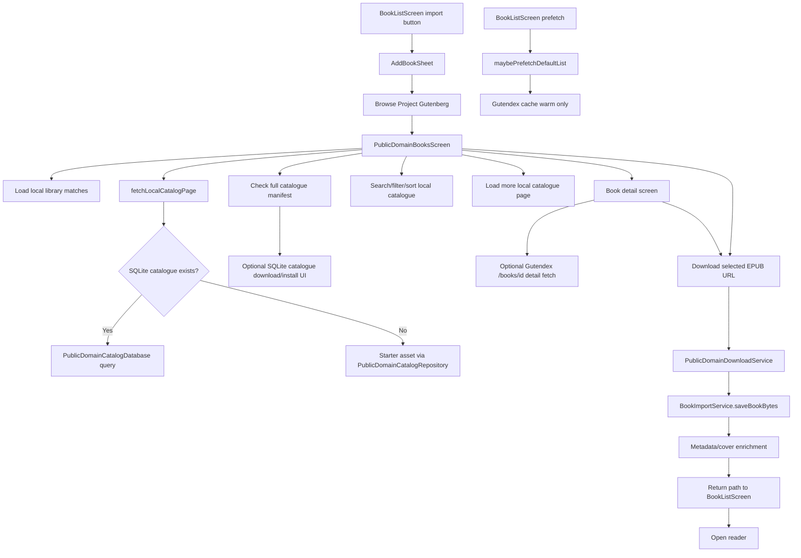
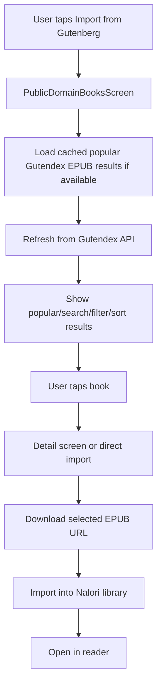

# Gutenberg API-Only Migration

## 1. Goal

Move Nalori's user-facing Gutenberg feature to a lean "find and import an EPUB" flow.

* Use Gutendex for discovery, search, language filtering, sort, and pagination.
* Use Project Gutenberg EPUB URLs only when the user chooses to download/import a selected book.
* Show popular public-domain EPUBs without requiring a local full-catalog install.
* Support title/book-name search, author search, language filtering, popular/oldest/newest sorting, load more, and download/import into Nalori.
* Do not host a catalogue for now.
* Do not promise complete Gutenberg catalogue coverage.

## 2. Non-Goals

* No hosted catalogue.
* No app-side SQLite full-catalog browsing in the main user-facing Gutenberg flow.
* No full-catalog download/install UX.
* No bulk EPUB download.
* No crawling Project Gutenberg pages.
* No full offline Gutenberg index.
* No support for non-EPUB formats yet.
* No claim that Nalori exposes the full Gutenberg library.

## 3. Current Implementation Summary

Entry points:

* `lib/widgets/add_book_sheet.dart`: `AddBookSheet` exposes a "Browse Project Gutenberg" action.
* `lib/screens/book_list_screen.dart`: `_showAddBookOptions()` opens `AddBookSheet`; `_browsePublicDomainBooks()` pushes `PublicDomainBooksScreen`; returned file paths open through `_openBook()` and `BookLoadingScreen`.
* `BookListScreen._refreshLibrary()` and `_showAddBookOptions()` call `PublicDomainBookService.maybePrefetchDefaultList()`.

Screens and widgets:

* `lib/screens/public_domain_books_screen.dart`: main browsing UI. It loads local library state for duplicate detection, search/filter/sort state, list cards, detail navigation, queued downloads, progress, cancellation, and import/open behavior.
* `PublicDomainBooksScreen._loadBooks()` currently calls `PublicDomainBookService.fetchLocalCatalogPage()`, so the main list is driven by installed SQLite or the bundled starter catalogue rather than Gutendex.
* `PublicDomainBooksScreen._checkForFullCatalog()` fetches an optional manifest and may show/download/install legacy complete-catalogue UI.
* `PublicDomainBooksScreen._maybePrefetchNextPage()` also uses `fetchLocalCatalogPage()`.
* `lib/screens/public_domain_book_detail_screen.dart`: shows a selected book, optionally fetches full Gutendex details through `fetchBookDetails(id)`, and delegates download/open to the list screen.

Services and models:

* `lib/models/public_domain_book.dart`: defines `PublicDomainBook`, `PublicDomainPerson`, `PublicDomainBookQuery`, `PublicDomainBookPage`, `PublicDomainSearchMode`, and `PublicDomainSort`.
* `PublicDomainBook.fromGutendex()` requires a usable `application/epub+zip` format URL, maps cover from `image/jpeg`, maps authors from `authors`, uses `Untitled` for missing title, and relies on `authorLabel` for the `Unknown Author` fallback.
* `lib/services/public_domain_book_service.dart`: currently contains both local catalogue APIs and Gutendex APIs.
* Local catalogue APIs: `fetchLocalCatalogPage()`, `findLocalCatalogBook()`, `readBundledBooks()`, `fetchCatalogManifest()`, and `installCatalog()`.
* Gutendex APIs: `fetchBooks()`, `fetchBooksAndCache()`, `fetchBooksCacheFirst()`, `fetchBookDetails()`, and `maybePrefetchDefaultList()`.
* Gutendex cache behavior uses `SharedPreferences` keys with `gutendex_cache_v1_` and `gutendex_detail_cache_v1_`, with shorter TTL for search and longer TTL for detail responses.
* Current remote list requests send `search` or `topic`, `sort` only when not popular, and `page`; they do not yet send `copyright=false`, `mime_type=application/epub+zip`, or `languages=<code>`.
* Current remote response handling locally filters public-domain EPUB records with `_isPublicDomainEpub()` and language matching in `_isEligibleBookResult()`.
* `lib/services/api_client.dart`: provides user-agent headers, host rate limiting, in-flight GET de-duping, timeouts, and retry/backoff for timeouts/socket errors plus HTTP 429/502/503/504.

Download/import flow:

* `lib/services/public_domain_download_service.dart`: downloads `PublicDomainBook.epubUrl`, streams progress, supports cancellation, checks non-200 responses, validates ZIP magic bytes, and saves through `BookImportService.saveBookBytes`.
* `PublicDomainBooksScreen._prepareDownloadedBook()` initializes metadata, extracts/cache metadata, optionally saves the remote cover, applies Gutendex title/author metadata, and records `source: gutenberg`, `gutenbergId`, `sourceUrl`, `downloadUrl`, and import metadata.
* Duplicate detection uses Gutenberg ID, generated filename, and title/author matching through `_existingFileFor()`.

SQLite/starter/full-catalog paths:

* `lib/services/public_domain_catalog_repository.dart`: reads installed SQLite via `PublicDomainCatalogDatabase` when present; otherwise reads `assets/catalog/gutenberg_starter_catalog.json`.
* `lib/services/public_domain_catalog_database.dart`: defines the SQLite schema and local query behavior.
* `lib/services/public_domain_catalog_installer.dart`: optionally fetches a manifest from `GUTENBERG_CATALOG_MANIFEST_URL`, downloads a compressed SQLite catalogue, verifies checksum/schema/count, and installs it atomically.
* `lib/models/public_domain_catalog.dart`: defines local catalogue cursor, status, page, source, and manifest types.

Tests:

* `test/widgets/public_domain_books_screen_test.dart`: currently fakes and asserts `fetchLocalCatalogPage()`, starter catalogue status, full catalogue status, pagination, search, filters, and stale-response handling.
* `test/unit/services/public_domain_book_service_test.dart`: covers Gutendex parsing, retries, timeout/server errors, malformed JSON, invalid response shape, detail fetch, local eligibility filtering, cache-first behavior, stale cache fallback, and bundled starter catalogue behavior.
* `test/unit/services/public_domain_download_service_test.dart`: covers EPUB download/save and non-EPUB byte rejection.
* `test/unit/services/public_domain_catalog_database_test.dart`: covers SQLite local search/filter/sort/pagination behavior.
* `test/unit/services/public_domain_catalog_installer_test.dart`: covers manifest parsing, verified install, checksum failure, preserving previous catalogue, and temporary cleanup.
* `test/widgets/add_book_sheet_test.dart`: covers add-book sheet copy and the Gutenberg browse callback.

## 4. Current Flow Diagram



## 5. Target Architecture

The target architecture keeps browsing lean and API-only. Local SQLite/starter catalogue code can remain dormant during the first migration, but it must not power or advertise the main user-facing Gutenberg browsing flow.



Top/popular books:

* Do not fetch multiple Gutendex pages on app launch.
* App launch prefetch, if retained, should fetch at most the first popular page.
* When the user opens the Gutenberg screen, show cached page 1 immediately if available.
* Load page 1 from Gutendex.
* Fetch page 2 only through the visible "Load more" flow, or as a very small screen-local prefetch after page 1 succeeds.
* Do not crawl beyond user-visible pages.

## 6. Gutendex API Contract

Gutendex `/books` responses are expected to include `count`, `next`, `previous`, and `results`. Gutendex page size is expected to be up to 32 books per page, so "around top 50" should be achieved through page 1 plus user-visible pagination rather than launch-time crawling.

Required list query parameters:

* Always send `copyright=false`.
* Always send `mime_type=application/epub+zip`.
* Send `search=<query>` for title/book-name/author search.
* Send `languages=<code>` when a language is selected.
* Send `sort=popular` for popular.
* Send `sort=ascending` for oldest.
* Send `sort=descending` for newest.
* Use Gutendex `next` URL for pagination when available.

Author search/listing:

* Use `search=<author name>` through Gutendex.
* Locally prioritize/filter exact author matches if needed.
* Do not crawl many pages trying to collect every book by an author.
* If exact author mode already exists, keep it bounded and API-friendly.

Topic search:

* Remove or hide topic/bookshelf search from the main API-only flow unless it is already very clean.
* Main supported search should be title/book name/author.

Response fields used:

* `id`: Gutenberg ID and duplicate/import metadata.
* `title`: display title, with existing `Untitled` fallback.
* `authors`: author display and exact-author matching.
* `summaries`: optional detail/preview copy.
* `subjects` and `bookshelves`: optional detail chips, not main search scope.
* `languages`: display/filter verification.
* `formats`: EPUB URL and cover URL selection.
* `download_count`: popularity display/sort context.
* `media_type`: optional detail metadata.
* `copyright`: public-domain eligibility check.
* `next` and `previous`: pagination.
* `count`: result count when available.

EPUB URL selection:

* Select the first `formats` entry whose MIME key starts with `application/epub+zip`.
* Do not display or import records without a usable EPUB URL.
* Keep local public-domain/EPUB filtering even after adding API params.

Cover URL selection:

* Select the first `formats` entry whose MIME key starts with `image/jpeg`.
* Missing cover uses the existing generated cover fallback.
* Cover fetch failures during import should not block import.

Malformed/empty response handling:

* Missing/non-list `results` is a catalogue error state, not a crash.
* Missing `next` means no further page.
* Empty valid `results` shows a no-results state.
* Missing title/author/cover fields use existing fallbacks.
* Individual records missing EPUB URLs are hidden or safely rejected.

## 7. New User-Facing Flow

Default state:

* Show popular public-domain EPUBs from Gutendex.
* Show cached page 1 quickly when available.
* Refresh page 1 from Gutendex.
* Do not launch-time fetch multiple Gutendex pages to reach a top-50 count.
* Use copy such as: "Search public-domain EPUBs from Project Gutenberg via Gutendex. For deeper catalogue browsing, visit Project Gutenberg."

Search:

* Support title/book-name/author search through `search=<query>`.
* Keep the existing debounce if it remains clean.
* Clear search resets to popular/default results.
* Do not expose topic/bookshelf search in the main API-only flow unless it is retained as a clean advanced option.

Filters:

* Language filter sends `languages=<code>`.
* Sort filter sends `sort=popular`, `sort=ascending`, or `sort=descending`.

Pagination:

* A visible "Load more" button is acceptable and preferred.
* Auto-fetch only if it is already clean, screen-local, and not aggressive.
* Fetch page 2 only via visible load more or a small screen-local prefetch after page 1 succeeds.
* Do not crawl the catalogue or prefetch beyond user-visible pages.

Status copy:

* Do not use copy that claims or implies a complete Gutenberg catalogue.
* Do not imply complete library coverage.
* Use Gutendex/Project Gutenberg metadata language honestly.

UI states:

* Initial loading.
* Showing cached results while refreshing.
* Offline with cached results.
* Offline with no cached results.
* Catalogue error with Retry.
* Search no-results.
* Loading more.
* Load-more failed with retry.
* Download queued.
* Downloading with progress.
* Download failed.
* Import failed.
* Imported/readable.

## 8. Implementation Plan

### Phase 1 - Confirm current wiring and decide what to bypass

**Goal:**
Make the API-only boundary explicit before production edits.

**Files likely changed:**

* `lib/screens/public_domain_books_screen.dart`
* `lib/services/public_domain_book_service.dart`
* `test/widgets/public_domain_books_screen_test.dart`

**Steps:**

1. Confirm every list load, refresh, search reload, prefetch, and load-more path.
2. Mark `fetchLocalCatalogPage()`, full-catalog manifest checks, starter catalogue status, and SQLite install UI as not used by the main screen.
3. Keep SQLite/starter APIs dormant for the first migration unless cleanup becomes trivial and low-risk.

**Expected behavior after phase:**
No product behavior change if this is only inspection/test preparation.

**Tests to run:**

* `flutter test test/widgets/public_domain_books_screen_test.dart`
* `flutter test test/unit/services/public_domain_book_service_test.dart`

### Phase 2 - Rewire main screen to Gutendex/cache-first list path

**Goal:**
Make `PublicDomainBooksScreen` use Gutendex cache-first discovery.

**Files likely changed:**

* `lib/screens/public_domain_books_screen.dart`
* `test/widgets/public_domain_books_screen_test.dart`

**Steps:**

1. Replace `fetchLocalCatalogPage()` calls with `fetchBooksCacheFirst()`.
2. Track and pass `PublicDomainBookPage.nextUrl` for load-more requests.
3. Preserve duplicate suppression through `_appendUniqueBooks()`.
4. Preserve refresh and stale-response generation guards.
5. Remove or bypass `_checkForFullCatalog()` from the main flow.
6. Ensure app launch prefetch, if retained, fetches at most the first popular page.

**Expected behavior after phase:**
Browsing, search, filters, refresh, and load more use Gutendex/cache instead of SQLite/starter catalogue.

**Tests to run:**

* `flutter test test/widgets/public_domain_books_screen_test.dart`

### Phase 3 - Fix Gutendex query params for EPUB/public-domain/language/sort/search

**Goal:**
Make remote requests match the API-only product contract.

**Files likely changed:**

* `lib/services/public_domain_book_service.dart`
* `test/unit/services/public_domain_book_service_test.dart`

**Steps:**

1. Always include `copyright=false`.
2. Always include `mime_type=application/epub+zip`.
3. Include `languages=<code>` when selected.
4. Include `sort=popular`, `sort=ascending`, or `sort=descending`.
5. Use `search=<query>` for title/book-name/author search.
6. Hide or remove main-flow topic search unless retained as a clean advanced option.
7. Keep exact-author filtering bounded and API-friendly.
8. Keep local eligibility filtering as a safeguard.
9. Ensure pagination with `nextUrl` follows the returned URL and does not rebuild conflicting params.

**Expected behavior after phase:**
Gutendex receives explicit EPUB/public-domain/language/sort/search params.

**Tests to run:**

* `flutter test test/unit/services/public_domain_book_service_test.dart`

### Phase 4 - Simplify/hide full-catalog and SQLite install UI messaging

**Goal:**
Remove full-catalog promises from the main user-facing flow.

**Files likely changed:**

* `lib/screens/public_domain_books_screen.dart`
* `lib/l10n/app_en.arb`
* `lib/l10n/app_en_IN.arb`
* Generated localization files if committed in this repo.

**Steps:**

1. Remove/hide full-catalog manifest status banners/actions from the main screen.
2. Remove complete-catalogue and starter-catalogue status copy from the main flow.
3. Add honest Gutendex/Project Gutenberg copy.
4. Keep SQLite/catalogue classes dormant unless a later cleanup phase removes them.

**Expected behavior after phase:**
Users see API-only copy and no full-catalog install affordance.

**Tests to run:**

* `flutter test test/widgets/public_domain_books_screen_test.dart`
* `flutter test test/widgets/add_book_sheet_test.dart`

### Phase 5 - Preserve download/import/reader flow

**Goal:**
Keep selected EPUB import working while improving failure handling.

**Files likely changed:**

* `lib/screens/public_domain_books_screen.dart`
* `lib/services/public_domain_download_service.dart`
* `test/unit/services/public_domain_download_service_test.dart`

**Steps:**

1. Keep duplicate detection by Gutenberg ID, filename, and title/author.
2. Keep queued download UI and cancellation behavior.
3. Keep current ZIP magic-byte validation as a first check.
4. Plan to strengthen EPUB validation to check a real EPUB container, not just any ZIP.
5. At minimum, validate that `mimetype` contains `application/epub+zip` and/or `META-INF/container.xml` exists.
6. If stricter validation is risky, add it as a focused later phase.
7. Improve error messages for missing URL, timeout, invalid EPUB, storage failure, and cancelled download.
8. If metadata extraction fails but the EPUB file is valid, import with Gutendex title/author metadata.
9. If cover fetch fails, continue without cover.

**Expected behavior after phase:**
Selected EPUBs still download, import, and open; already-imported books show "In Library" / "Read".

**Tests to run:**

* `flutter test test/unit/services/public_domain_download_service_test.dart`
* Focused widget tests for download/import/open states.

### Phase 6 - Update tests

**Goal:**
Align coverage with API-only behavior and error handling.

**Files likely changed:**

* `test/widgets/public_domain_books_screen_test.dart`
* `test/unit/services/public_domain_book_service_test.dart`
* `test/unit/services/public_domain_download_service_test.dart`

**Steps:**

1. Replace local-catalogue widget fakes with cache-first Gutendex fakes.
2. Add query-param tests for copyright, MIME type, language, search, and sort.
3. Add stale-cache and network failure tests.
4. Add malformed response and missing EPUB URL tests.
5. Add load-more `nextUrl` failure/retry tests.
6. Add download timeout, invalid EPUB, metadata extraction failure, cover failure, and cancellation tests.
7. Update or quarantine SQLite installer/database tests if the code remains dormant.

**Expected behavior after phase:**
Tests describe the API-only user-facing contract.

**Tests to run:**

* `flutter test test/widgets/public_domain_books_screen_test.dart`
* `flutter test test/unit/services/public_domain_book_service_test.dart`
* `flutter test test/unit/services/public_domain_download_service_test.dart`
* Full `flutter test` if runtime is acceptable.

### Phase 7 - Cleanup and documentation update

**Goal:**
Remove dead UI paths and keep docs accurate.

**Files likely changed:**

* `docs/gutenberg_api_only_migration.md`
* Potentially `pubspec.yaml`, `assets/catalog/gutenberg_starter_catalog.json`, `tool/generate_gutenberg_*`, and local catalogue tests in a later cleanup.

**Steps:**

1. Append Work Log entries as implementation proceeds.
2. Decide whether to keep SQLite/starter catalogue code dormant for one release or remove it.
3. If removed, delete asset references, generator tooling, and tests in one focused cleanup.

**Expected behavior after phase:**
Documentation matches shipped behavior and obsolete catalogue UI/code is either dormant or removed.

**Tests to run:**

* Full `flutter test` after any cleanup.

## 9. Test Plan

Unit and widget coverage to update/add:

* Default screen request uses Gutendex/cache-first path.
* Request includes `copyright=false`.
* Request includes `mime_type=application/epub+zip`.
* Language filter sends `languages=<code>`.
* Search sends `search=<query>`.
* Sort maps correctly:
  * popular -> `sort=popular`
  * oldest -> `sort=ascending`
  * newest -> `sort=descending`
* Load more follows `next`.
* Duplicate books are not appended.
* Stale/cached popular results display on network failure.
* Full-catalog/SQLite install messaging is not shown in the main API-only flow.
* Selected EPUB still downloads/imports/opens correctly.
* Existing timeout/retry/malformed response tests still pass or are updated to match the new intended behavior.

Error-handling coverage:

1. No internet plus cached popular results shows cached results and offline/stale banner.
2. No internet plus no cache shows friendly error with Retry.
3. Timeout from Gutendex retries and falls back to cache when available.
4. 503 from Gutendex triggers retry/backoff/fallback behavior.
5. Malformed JSON shows catalogue error state and does not crash.
6. Missing EPUB URL hides or safely rejects the book.
7. Load-more failure keeps existing results visible and shows load-more retry.
8. EPUB download timeout shows friendly download error.
9. Invalid EPUB bytes are rejected and not imported.
10. Metadata extraction failure still imports a valid EPUB with API metadata.
11. Cover download failure continues import without cover.
12. Cancelled download does not show a failure snackbar/import state.

## 10. Risks and Safeguards

* Gutendex availability: use `ApiClient` retry/backoff, cache-first loading, stale/offline banners, and Retry.
* Incomplete Gutenberg coverage through Gutendex: use honest copy and avoid full-library claims.
* Sparse results if filtering is wrong: add explicit query-param tests and keep local eligibility filtering.
* Incorrect EPUB URL selection: test MIME-prefix selection and missing-URL rejection.
* Breaking import/open flow: preserve current download/import handoff and add focused tests.
* Stale cache confusion: label stale/offline results clearly.
* Old SQLite code still affecting UI: remove main-screen manifest/install calls and assert full-catalog text is absent.
* Tests expecting old local-catalog behavior: rewrite widget fakes around `fetchBooksCacheFirst()` and `nextUrl`.
* EPUB validation too weak: keep magic-byte validation initially, then strengthen to real EPUB container checks.
* Stricter EPUB validation causing false negatives: add stricter validation in a focused phase with fixtures before relying on it broadly.

## 11. Rollback Plan

If the API-only flow causes issues:

* Revert `lib/screens/public_domain_books_screen.dart` to the previous `fetchLocalCatalogPage()` list source.
* Revert Gutendex query-param changes in `lib/services/public_domain_book_service.dart`.
* Revert related l10n and test changes.
* If SQLite/starter code remains dormant, previous behavior can be restored without rebuilding that infrastructure.
* If useful, add a temporary internal feature flag around the list source before deleting old paths.
* Restore previous behavior by enabling local catalogue calls, manifest checks, and starter/full-catalog status messaging only if the product decision changes.

## 12. Open Questions

* Should default language remain English (`en`) or become "Any language"?
* Should the detail screen always remain between list and download, or should list-card download stay as a direct import shortcut?
* Should topic/bookshelf search be removed entirely from the main UI or kept only as a hidden/internal route from detail chips?
* Should SQLite/starter catalogue code be deleted in this migration or left dormant for one release?
* Should "visit Project Gutenberg" become an external link/action later, or copy only?
* Should stricter EPUB container validation ship in the main migration or as the first follow-up phase?

Assumptions:

* Keep current default language behavior unless product changes it.
* Keep the detail screen.
* Keep SQLite/starter code dormant during the first API-only migration.
* Prefer manual "Load more" over aggressive auto-prefetch.
* Keep exact-author behavior bounded and do not crawl many pages for author completeness.

## 13. Decision Log

| Date | Decision | Reason | Impact |
| --- | --- | --- | --- |
| 2026-06-24 | Move user-facing Gutenberg browsing to API-only Gutendex flow for now. | Product wants a lean find-and-import EPUB flow without hosting, local full-catalog install, or full-library claims. | Main browsing flow uses Gutendex search/list API; Project Gutenberg URLs are used only for selected EPUB downloads. |

## 14. Work Log

No implementation work logged yet.

Future implementation sessions must append entries at the bottom using this format:

```markdown
### YYYY-MM-DD HH:MM - Session Title

**Goal:**
What this session attempted.

**Files changed:**

* file path
* file path

**What changed:**

* bullet
* bullet

**Why:**
Explain reasoning.

**Tests run:**

* command
* result

**Issues found:**

* issue or "None"

**Next recommended step:**
One clear next step.
```

Important documentation rule:

* Do not rewrite or delete old Work Log entries.
* If something in an old entry becomes outdated, add a new entry explaining the correction.
* Keep the document useful for a human developer who wants to understand what changed and why.
