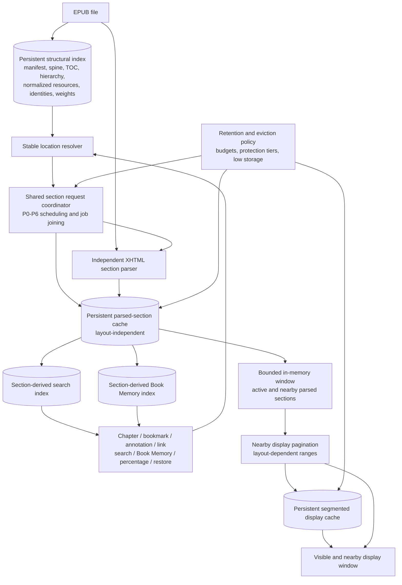

# Nalori Lazy Random-Access Reader Implementation Plan

## 1. Goal

Deliver a reader that opens and reopens quickly, keeps layout changes snappy, and can navigate directly to any chapter, bookmark, annotation, internal link, search result, or Book Memory reference without parsing intermediate chapters. Complete-book navigability must be available from lightweight structure even while source parsing and pagination remain partial. Source and display memory must stay bounded, and normal library activity must not trigger unnecessary whole-library parsing.

## 2. Current Confirmed Architecture

The current tree already contains the foundation for an incremental migration:

- `LazyEpubIndexService` builds a complete in-memory manifest, spine, TOC, and chapter hierarchy, but the index is rebuilt on every open and uses filename-derived `bookId` rather than a publication fingerprint.
- `LazyBookSession.loadAround` and `LazySectionRepository.loadSection` can load a distant target XHTML section directly without parsing intermediate spine items.
- `ParsedSectionCacheService` persistently stores layout-independent parsed sections with XHTML checksum and parser-version validation, but has no process-wide work coordination, byte budget, or last-access eviction.
- `ReaderScreen` progressively paginates a bounded initial display range and uses `SegmentedDisplayCacheService` plus `DisplaySectionMemoryCache` for layout-dependent reuse.
- Adjacent warmup and resumable hydration exist, but hydration is session-owned speculative work and can eventually traverse the whole readable spine.
- `BookPreparseService`, `CachedBook`, and the eager parser remain active as a compatibility path. Library refresh also queues whole-library preparation automatically, and unchanged oversized results can be retried indefinitely.
- `ReaderScreen` still treats replaceable lazy-window chunk/display indexes and counts as publication-global in several paths. Its source arrays may also retain accumulated sections longer than the repository window.
- In-reader search scans the currently loaded source window and returns integer chunk indexes. `BookMemoryService` still consumes `CachedBook.chunks` and `CachedBook.chapters`; character occurrences and Book Memory jumps remain legacy-index based.

The evidence and detailed call-path analysis are in `docs/epub_parsing_system_audit.md` and `docs/lazy_random_access_reader_verification.md`. Current-tree reachability checks confirmed the named components and consumers; no material contradiction was found.

## 3. Target Architecture

The structural index is publication-wide truth. Parsed sections are reusable source derivatives. Display ranges are disposable layout derivatives. Search and Book Memory are independently versioned section-derived indexes whose results always carry stable destinations.

## 4. Architectural Invariants

- Loaded-window indexes are never publication-global truth.
- Display indexes are never stable source identity.
- Loaded chunk counts are never whole-book totals.
- Complete navigation does not require complete parsing.
- Parsed source data is layout-independent.
- Reader settings do not reparse XHTML.
- A distant jump loads its target section directly.
- Intermediate sections are not required for a distant jump.
- Partial progress must never be presented as exact progress.
- Cache eviction must never delete annotations, stable reading positions, or the persistent structural index.
- Legacy fallback data remains available until its stable replacement resolves and persists successfully.
- Giant sections are not speculatively hydrated by default.
- Background and speculative work yields to explicit user navigation.
- Entire sessions and entire books are never retained in memory as a cache strategy.
- Search and Book Memory coverage is explicit; incomplete derived coverage cannot be reported as complete.
- Legacy whole-book parsing is an explicit compatibility operation only, never implicit library maintenance.

## 5. Canonical Identity and Location Model

Identity is hierarchical rather than a single global integer:

1. **Logical library book ID:** durable user/library identity and ownership of metadata and annotations.
2. **Publication fingerprint:** identity of the actual EPUB content/version, separate from filename; invalidates source derivatives after replacement.
3. **Spine index:** canonical publication order within that fingerprint.
4. **Normalized XHTML href:** canonical resource mapping used with spine identity and to resolve links/TOC targets.
5. **Section checksum:** identity of the XHTML payload and, when parsing begins to depend on them, relevant resource dependencies.
6. **Anchor or stable source element:** preferred exact target inside a section.
7. **Source offset:** position within the stable source element/block.
8. **Quote/context fallback:** ranked recovery when element identity or offsets no longer match.
9. **In-section progression:** approximate fallback inside a resolved section.
10. **Weighted whole-book progression:** structural fallback using readable-spine prefix weights, refined by parsed text measurements.
11. **Legacy indexes:** migration hints only; never canonical identity.

`StableBookLocation`, `LazyEpubIndex`, `LazyEpubSpineItem`, `LazyEpubManifestItem`, and `LazyEpubChapter` should be extended rather than replaced by parallel models. Field-level schema design must follow current serialization and resolver constraints. A stable replacement is written only after publication compatibility and target resolution succeed; failed or ambiguous resolution retains legacy data.

## 6. Cache Architecture and Retention

| Layer | Role | Retention and validity |
|---|---|---|
| Persistent structural index | Complete publication map and weighted progression | Schema-versioned; retained for every library book; validated by publication fingerprint/file evidence; removed with the book. |
| Persistent parsed-section cache | Layout-independent parsed XHTML, anchors, chunks, chapters, resources | Publication- and section-aware; byte-sized; last-access eviction; no fixed age expiry for cold records. |
| In-memory active section window | Current and nearby parsed source only | Strictly bounded by sections/bytes; active target and immediate neighbors protected; cleared/replaced without losing source position. |
| Persistent segmented display cache | Layout-keyed visible/nearby ranges | Bounded by bytes; access tracked; obsolete layouts and cold ranges evicted before parsed source. |
| Derived search index | Section-token/text records with stable result targets | Section checksum/parser/index-version invalidation; explicit coverage. |
| Derived Book Memory index | Stable annotation sources and per-section character occurrences | Section-derived, resumable, independently versioned; explicit partial/complete coverage. |

Default persistent budgets are **192 MiB for parsed source** and **48 MiB for display cache**. Both must be configurable and adaptable under low-storage conditions. These are profiling defaults, not immutable constants.

Protection tiers are:

1. Active book: highest protection for the active target, adjacent parsed records, and visible/nearby display ranges.
2. Two most recently meaningfully read books: secondary parsed-cache protection for useful last-visible and adjacent records; no retained live session and no whole-book memory residency.
3. Cold books: retained opportunistically until byte pressure, then evicted by last access.

Eviction order is obsolete/corrupt display data, cold display layouts/ranges, unprotected cold parsed sections, then reduced recent-book protections under low storage. Active source needed to keep the current reading target valid is last among cache derivatives. Low storage stops or throttles P4-P6 work and may shrink configured budgets, but never deletes user data or structural navigation truth.

Deletion must be a coordinated per-publication transaction covering structural index, parsed sections and hydration state, display caches, derived indexes, validity/outcome records, and temporary files. Publication/parser/dependency changes must invalidate only affected derivatives safely. Old cache formats are not deleted before Phase 7.

## 7. Work Priority Model

| Priority | Work |
|---|---|
| P0 | Explicit user-requested target: chapter, annotation, link, history, percentage, search, or Book Memory destination. |
| P1 | Visible section load, source resolution, and first visible card. |
| P2 | Adjacent section/card readiness required for immediate reading and Card Mode depth/swipes. |
| P3 | Selected chapter/target preview or preparation that the user has indicated but not yet opened. |
| P4 | Current-book idle hydration under cache, lifecycle, and device policy. |
| P5 | Recent-book idle hydration without retaining a session solely for that purpose. |
| P6 | Resumable search and Book Memory indexing. |

P0-P2 work preempts or pauses queued P3-P6 work. Speculative work must not delay cache reads, parsing, source resolution, or pagination required by P0-P2. Giant sections are skipped by speculative queues unless measurement-backed policy later permits them.

## 8. Phase Plan

### Phase 1 — Stop avoidable legacy work safely

- **Goal:** Remove automatic eager whole-library work and make every remaining whole-book parse an explicit compatibility action with a durable outcome.
- **Preconditions:** Current lazy open behavior remains enabled; known legacy reader and Book Memory consumers remain reachable and covered.
- **Primary components:** `BookPreparseService`, `BookCacheService`, `BookListScreen`, `BookLoadingScreen`, `BookMemoryService`.
- **Likely files:** `lib/services/book_preparse_service.dart`, `lib/services/book_cache_service.dart`, `lib/screens/book_list_screen.dart`, `lib/screens/book_loading_screen.dart`, `lib/services/book_memory_service.dart`; focused tests in `test/unit/services/book_preparse_service_test.dart`, `test/unit/services/book_cache_service_test.dart`, `test/unit/services/book_memory_service_test.dart`, and relevant screen/widget tests.
- **Data migration:** Add lightweight, fingerprint-aware preparation validity/outcome metadata while keeping existing `CachedBook` payloads readable. Outcomes distinguish cached/already valid, stored, terminal oversized, invalidated/changed, and failed/retryable states.
- **Required tests:** Library refresh does not queue ordinary eager parsing; unchanged oversized output is terminal and not reparsed; changed-file evidence invalidates the outcome; validity checks do not deserialize full payloads; explicit legacy reader load still works; explicit Book Memory compatibility preparation still works; reset/deletion clears outcome metadata.
- **Main risks:** A hidden consumer may have relied on refresh-time preparation; outcome semantics could incorrectly suppress retries after content changes; cleanup could strand legacy compatibility data.
- **Explicit non-goals:** No structural-index persistence, stable-location redesign, ReaderScreen behavior change, parsed-cache budget, search migration, Book Memory migration, or legacy parser deletion.
- **Exit criteria:** Normal library refresh triggers no whole-book parse; unchanged oversized books do not retry; lightweight validity probing is used when content is not needed; every remaining eager parse maps to a named explicit compatibility consumer; current lazy reader behavior is unchanged.
- **User-visible benefit:** Less background CPU, I/O, heat, battery drain, and refresh/reopen contention without changing reading behavior.

### Phase 2 — Persistent structural index

- **Goal:** Reuse the complete publication map across valid reopens and provide normalized lookups and structural progression without parsing XHTML.
- **Preconditions:** Phase 1 has removed implicit eager work; current `LazyEpubIndex` behavior and malformed-book fallbacks have regression coverage.
- **Primary components:** `LazyEpubIndexService`, existing index models, `LazyBookSession`, `ReaderOpenService`, metadata and deletion services.
- **Likely files:** `lib/services/lazy_epub_index_service.dart`, `lib/services/lazy_parsed_book.dart`, `lib/services/lazy_book_session.dart`, `lib/services/reader_open_service.dart`, `lib/models/book_metadata.dart`, `lib/services/book_metadata_service.dart`, and a persistence adapter/service; tests in `lazy_epub_index_service_test.dart`, `lazy_book_session_test.dart`, and fixture suites.
- **Data migration:** Lazily build a schema-versioned record on first open. Add logical book identity, publication fingerprint, file validity evidence, normalized resource/href maps, chapter-to-spine resolution status, readable linear-spine weights, and prefix progression. Do not persist the live archive handle.
- **Required tests:** Serialization round trip; valid reopen uses the record without rebuilding the map; same-name replacement invalidates; parser/index schema changes invalidate safely; normalized href and fragment resolution; non-linear exclusion; malformed TOC warnings/fallback; deletion removes the index.
- **Main risks:** Weak timestamp-only validity, ambiguous paths, preserving malformed resolutions, and coupling index availability to archive lifetime.
- **Explicit non-goals:** No source-section parsing during index creation, no full anchor directory, no ReaderScreen global-index replacement, and no giant-XHTML subdivision.
- **Exit criteria:** A valid record supplies manifest, spine, TOC, chapter hierarchy, normalized lookup, stable section identity inputs, and weighted progression without parsing XHTML or rebuilding the publication map; miss/rebuild remains correct.
- **User-visible benefit:** Faster reopen and immediate complete structural navigation.

### Phase 3 — Stable random-access navigation

- **Goal:** Make every user destination resolve through publication-aware stable source semantics and directly load only its target section.
- **Preconditions:** Phase 2 identity and normalized lookup are available; legacy fields remain readable.
- **Primary components:** `StableBookLocation`, `LazyBookSession`, `ChapterNavigationService`, `ReaderOpenService`, `BookLoadingScreen`, `ReaderScreen`, position history, bookmark/highlight/saved-word models and services.
- **Likely files:** `lib/models/stable_book_location.dart`, `lib/models/position_history.dart`, `lib/models/bookmark.dart`, `lib/models/highlight.dart`, `lib/models/saved_word.dart`, `lib/services/lazy_book_session.dart`, `lib/services/chapter_navigation_service.dart`, `lib/services/reader_open_service.dart`, `lib/screens/book_loading_screen.dart`, `lib/screens/reader_screen.dart`.
- **Data migration:** Resolve legacy last-read positions, bookmarks, highlights, notes, saved words, and history lazily. After successful stable resolution, persist the stable replacement while retaining legacy fields through the migration period.
- **Required tests:** Direct chapter, anchor, bookmark, highlight, note, internal-link, footnote-return, last-read, weighted percentage, and Back-history navigation; unloaded and backward targets; parser-version/chunk-count changes; same-name replacement; missing/malformed fragments; ambiguous quote/context confidence; automatic successful migration.
- **Main risks:** Ambiguous repeated text, stale checksums, incomplete legacy evidence, non-spine resources, and accidental fallback to loaded-window/display indexes.
- **Explicit non-goals:** No complete-book parsing, no forced adjacent/intermediate loading, no removal of legacy fields, and no search/Book Memory derived-index implementation.
- **Exit criteria:** Every listed destination follows stable target -> structural resolution -> direct target-section load; intermediate sections are unnecessary; display/window indexes are only same-layout/local hints; successful legacy resolutions persist automatically.
- **User-visible benefit:** Reliable direct navigation throughout the complete book regardless of what is loaded.

### Phase 4 — Shared section work and cache retention

- **Goal:** Join identical section work across sessions, coordinate writes, and enforce safe byte-budgeted parsed-source retention.
- **Preconditions:** Phase 2 publication identity is canonical and Phase 3 destinations identify exact target sections.
- **Primary components:** `LazySectionRepository`, `ParsedSectionCacheService`, shared work coordinator, metadata recency, deletion/invalidation paths.
- **Likely files:** `lib/services/lazy_section_repository.dart`, `lib/services/parsed_section_cache_service.dart`, `lib/services/lazy_book_session.dart`, `lib/models/book_metadata.dart`, `lib/services/book_metadata_service.dart`, `lib/screens/book_list_screen.dart`, display/deletion services as transaction participants.
- **Data migration:** Upgrade manifests with publication/dependency identity, schema/parser versions, payload bytes, and last access. Old records are validated and upgraded or safely missed; no risky blind conversion.
- **Required tests:** Cross-session request joining; one parse per full identity; shared cache-write serialization and manifest union; close/reopen during work; publication/resource/parser invalidation; 192 MiB configurable budget behavior; last-access eviction; active/two-recent/cold tiers; low-storage policy; full cache deletion transaction; no annotation/location deletion.
- **Main risks:** Race conditions between parse/write/delete, over-protection exceeding budget, stale dependency signatures, and cancellation of reusable atomic writes.
- **Explicit non-goals:** No whole-session retention, no whole-book memory retention, no display-layout redesign, and no giant-section subdivision.
- **Exit criteria:** Identical cross-session jobs join; cache writes/deletion are coordinated; parsed disk and memory residency are bounded; active and two recent books receive byte-aware protection; cold records remain until pressure and then evict by last access.
- **User-visible benefit:** Faster reopen and navigation with less duplicate work and controlled storage/memory.

### Phase 5 — ReaderScreen and Card Mode responsiveness

- **Goal:** Remove publication-global assumptions from `ReaderScreen`, bound source/display residency, and publish target/reflow content with nearby-only layout work.
- **Preconditions:** Stable navigation and shared parsed-cache identity from Phases 3-4 are available.
- **Primary components:** `ReaderScreen`, `LazyBookSession`, progressive display generation, `SegmentedDisplayCacheService`, `DisplaySectionMemoryCache`, `CardDepthChapterProgressService`, `ReadingCardDeck`.
- **Likely files:** `lib/screens/reader_screen.dart`, `lib/services/lazy_book_session.dart`, `lib/services/segmented_display_cache_service.dart`, `lib/services/display_section_memory_cache.dart`, `lib/services/card_depth_chapter_progress_service.dart`, `lib/widgets/reading_card_deck.dart`.
- **Data migration:** Display manifests may gain publication/range identity, last access, generation ownership, and scoped completeness. Source data requires no layout migration.
- **Required tests:** Long-session bounded source/display residency; section-aware mappings across append/prepend/replacement; distant-jump atomic first-card replacement; every layout setting reuses parsed source; nearby-only pagination; Card Mode current/two-forward/one-back readiness across section boundaries; `n / ?`; structural global/chapter progress; no false whole-book totals; obsolete display eviction before source.
- **Main risks:** Broad index coupling in selection, annotations, progress, analytics, chapter detection, history, and display caching; transient blank states; stale generation publication.
- **Explicit non-goals:** No complete-book repagination, no full-chapter foreground completion for exact Card totals, no source reparse on settings changes, and no reader rewrite.
- **Exit criteria:** ReaderScreen retains active/nearby sections only; source mappings are section-aware; loaded-window counts never become publication totals; current target/reflow card swaps atomically before warmup; settings never reparse XHTML; Card Mode works with partial totals and never broad-parses or paginates merely to prove a denominator.
- **User-visible benefit:** Bounded long-session memory, faster distant jumps and reflow, and responsive Card Mode.

### Phase 6 — Search and Book Memory migration

- **Goal:** Replace `CachedBook` and loaded-window dependencies with section-derived, stable-destination indexes.
- **Preconditions:** Persistent structure, stable destinations, shared P6 scheduling, and section invalidation semantics are available.
- **Primary components:** `SearchScreen`, `ReaderScreen` search entry, search persistence, `BookMemoryService`, `BookCharacterOccurrenceService`, Book Memory screens/models.
- **Likely files:** `lib/screens/search_screen.dart`, `lib/screens/reader_screen.dart`, a new or extended search persistence service using existing storage capability, `lib/services/book_memory_service.dart`, `lib/services/book_character_occurrence_service.dart`, `lib/screens/book_memory_screen.dart`, `lib/screens/book_memory_writing_screen.dart`, related models/tests.
- **Data migration:** Annotation sources become stable records immediately when resolvable. Search and character occurrence records rebuild section by section. Legacy occurrence indexes remain fallback/stale evidence until converted. Coverage is stored and reported.
- **Required tests:** Incremental and resumed indexing; per-section checksum/parser invalidation; stable unloaded-result jumps; partial and complete search coverage; Book Memory partial/complete character coverage; stable first/last occurrences; spoiler boundary by structural progression; explicit compatibility while incomplete; no migrated feature read of `CachedBook`.
- **Main risks:** User expectations for immediate complete results, index size/query latency, stale partial aggregates, and incorrect claims of completeness.
- **Explicit non-goals:** No display pagination for indexing, no foreground parse of the entire book for exact counts, and no deletion of legacy formats yet.
- **Exit criteria:** Search and Book Memory use structural/parsed/derived records, every result has a stable target, coverage is honest, and neither feature depends on `CachedBook`.
- **User-visible benefit:** Complete direct search and Book Memory navigation with resumable background preparation and clearly labelled partial coverage.

### Phase 7 — Legacy retirement

- **Goal:** Retire obsolete eager parser/cache consumers and formats only after migrations and compatibility evidence prove them unnecessary.
- **Preconditions:** Phases 1-6 exit criteria are met; old-install and malformed-book evidence is available; rollback window is defined.
- **Primary components:** `BookPreparseService`, legacy `BookCacheService` payload APIs, legacy route flags/fallbacks, whole display cache, migration and cleanup paths.
- **Likely files:** `lib/services/book_preparse_service.dart`, `lib/services/book_cache_service.dart`, `lib/screens/book_loading_screen.dart`, `lib/screens/book_list_screen.dart`, `lib/services/book_memory_service.dart`, route/configuration and migration tests.
- **Data migration:** Perform final automatic location/annotation upgrades when resolvable. Preserve unresolved fallback evidence. Remove dormant cache formats only after forward/rollback compatibility and cleanup are verified.
- **Required tests:** Old-install fixtures; final location/annotation migration; malformed EPUB fallback; rollback/forward schema handling; repository reachability proving no production `CachedBook` consumer; cache cleanup; complete reader/search/Book Memory regressions.
- **Main risks:** Rare unresolved legacy positions, malformed EPUBs that only the old path handles, and premature cache-format deletion.
- **Explicit non-goals:** No removal of a fallback still required by evidence and no speculative parser rewrite.
- **Exit criteria:** No production consumer requires the eager whole-book path; all legacy formats have verified retirement/rollback paths; unused automatic parser/cache code is removed; malformed-book fallback remains only where evidence requires it.
- **User-visible benefit:** One coherent lazy architecture, lower storage/maintenance cost, and no accidental eager work.

## 9. Cross-Phase Test Strategy

Each phase adds focused unit tests plus the narrowest integration/widget coverage needed for its boundary. Existing regression suites remain mandatory for affected components. The migration must cover:

- Existing lazy index, session, repository, parsed cache, segmented cache, display coordinator/scheduler, parser equivalence, Card progress, ReaderScreen, annotation, and Book Memory regression suites.
- Cache schema validity, corruption recovery, outcome migration, safe invalidation, cleanup, and rollback.
- Direct navigation to an unloaded section for every destination type, including backward jumps and history return.
- Replacement of an EPUB with different content under the same filename.
- Structural, parser, derived-index, and display-layout version changes.
- Rapid close/reopen and route exit during open, parse, write, pagination, warmup, and hydration.
- Cross-session duplicate requests and concurrent same/different-section cache writes.
- Storage pressure, configurable budgets, protection tiers, and complete per-book deletion.
- Long reading sessions proving bounded parsed source and display memory.
- Font size/family/weight, line height, paragraph spacing, margin, density, text scale, orientation/viewport, safe area, Card Mode, and Card depth changes without XHTML reparse.
- Card Mode depth/swipe boundaries, partial totals, and no forced chapter completion.
- Search partial/complete coverage, invalidation, resume, and stable unloaded-result jumps.
- Book Memory partial/complete coverage, occurrence stability, annotations, and spoiler/read progression.
- Legacy install migration with unresolved fallback retained.
- Malformed EPUB navigation/resource behavior.
- Giant single-XHTML EPUB latency, speculative-skip behavior, memory, and explicit-target correctness; subdivision remains a later evidence-driven optimization.

Broad suites are run only when phase risk warrants them; every phase must at minimum run focused tests, `flutter analyze`, and `git diff --check` before its exit criteria are marked met.

## 10. Data Migration Strategy

- Every persisted structural, parsed, display, search, Book Memory, preparation-outcome, and location record has an explicit schema/version owner.
- Migration is lazy on book open or feature access, with bounded background continuation where appropriate.
- Legacy indexes, fields, and cache formats remain readable through the migration period.
- Stable replacements are written only after publication validation and successful target resolution; unresolved/ambiguous data is not overwritten.
- When conversion cannot be proven safe, invalidate the derived cache and rebuild from the EPUB rather than guessing.
- Writes are atomic and old compatible data remains available until the new record commits successfully.
- Rollback considerations are defined before changing a shared manifest or deleting a format; new code must tolerate missing/newer invalidatable derivatives safely.
- Old formats are deleted only in Phase 7 after consumer reachability, migration fixtures, rollback/forward handling, and cleanup have been verified.

## 11. Observability Requirements

Later implementation phases must emit structured events containing, where applicable:

- Publication fingerprint and logical book ID.
- Reader, session, repository, coordinator/cache-service, and route IDs.
- Section-job ID plus spine index, normalized href, checksum, and parser/dependency version.
- Cache hit, miss, corruption, invalidation, or eviction reason.
- Work priority and whether a request joined existing work or created new work.
- Parse duration, source/output bytes, chunk/text counts, and giant-section classification.
- First visible card latency for initial open, navigation, and settings reflow.
- Display generation/range ID, layout identity, source-range identity, cancellation, and discarded work.
- Eviction decision, byte pressure, protection tier, and before/after usage.
- Search and Book Memory indexed-section coverage and completeness.
- Location resolution strategy, publication match, fallback order, confidence, and migration result.

Logging is not implemented by this planning task.

## 12. Product Decisions

### Settled defaults

These are the current product defaults for implementation:

- Parsed source-cache budget: **192 MiB**.
- Display-cache budget: **48 MiB**.
- Budgets are configurable and adapt under low-storage conditions.
- Cold parsed sections remain until byte pressure rather than expiring on a fixed timer.
- Last-access eviction is used for cold parsed sections.
- Obsolete and cold display layouts are evicted before parsed source sections.
- The active book receives the highest cache protection.
- The two most recently meaningfully read books receive secondary parsed-cache protection.
- Entire sessions and entire books are not retained in memory.
- Percentage jumps may initially use weighted approximate structural progression and refine after the target section is parsed.
- Book Memory may display clearly labelled partial indexing coverage while background preparation continues.
- Legacy positions, bookmarks, and annotations migrate automatically after successful stable resolution.
- Legacy fields remain temporarily as fallback during the migration period.
- Partial Card Mode progress such as `n / ?` is acceptable.
- Exact Card Mode chapter totals must not trigger broad foreground parsing or pagination.

### Profiling-controlled values

The numeric budgets, adaptive low-storage thresholds, protection shares, scheduling concurrency, warmup distances, and giant-section thresholds may be adjusted through measured profiling. Such adjustment must preserve the invariants and protection/eviction ordering above; the defaults are not immutable constants.

## 13. Definition of Completion

The migration is complete only when all of the following are true:

- No normal library refresh triggers whole-book parsing.
- Complete structural navigation is available after persistent index load.
- All user destinations use stable, publication-aware source targets.
- Distant navigation loads its target section without intermediate parsing.
- `ReaderScreen` source and display memory remain bounded during long sessions.
- Settings changes never reparse source XHTML and lay out only visible/nearby ranges.
- Search and Book Memory no longer depend on `CachedBook` and report derived coverage honestly.
- Progress never treats a lazy window or loaded chunk/display count as the full book.
- Active/recent parsed and display caches obey configured byte budgets and eviction policy.
- Cache deletion/invalidation is coordinated without touching annotations or stable positions.
- Legacy consumers and formats have verified migration, fallback, rollback, and retirement paths.
- Giant single-XHTML resources remain correct as explicit targets and do not enter speculative work by default; any subdivision is separately evidence-driven.
- All seven phase exit criteria and cross-phase regressions pass. Completion of one phase is not completion of the migration.

## 14. Change-Control Rules

- Update this plan only when architecture, phase boundaries, invariants, or product decisions change.
- Record implementation discoveries first in `docs/lazy_random_access_reader_progress.md`.
- Any deviation must cite concrete code/runtime/test evidence and name the affected phases and exit criteria.
- A later phase may not depend on an earlier phase until the earlier phase's exit criteria are met and recorded.
- Do not mark the full migration complete after an individual phase.
- Keep extensions within current components where their responsibility already fits; do not introduce parallel reader, identity, or index systems without evidence and a recorded plan change.
