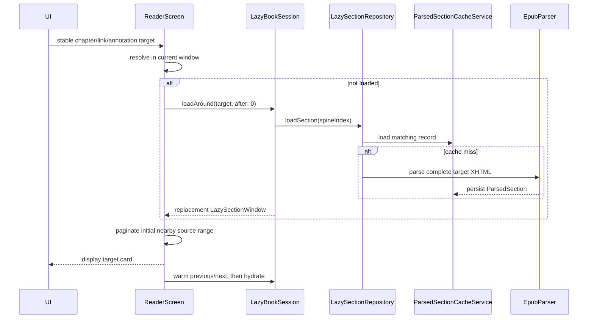
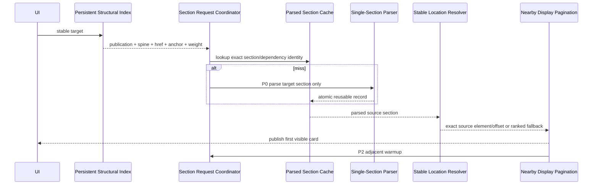
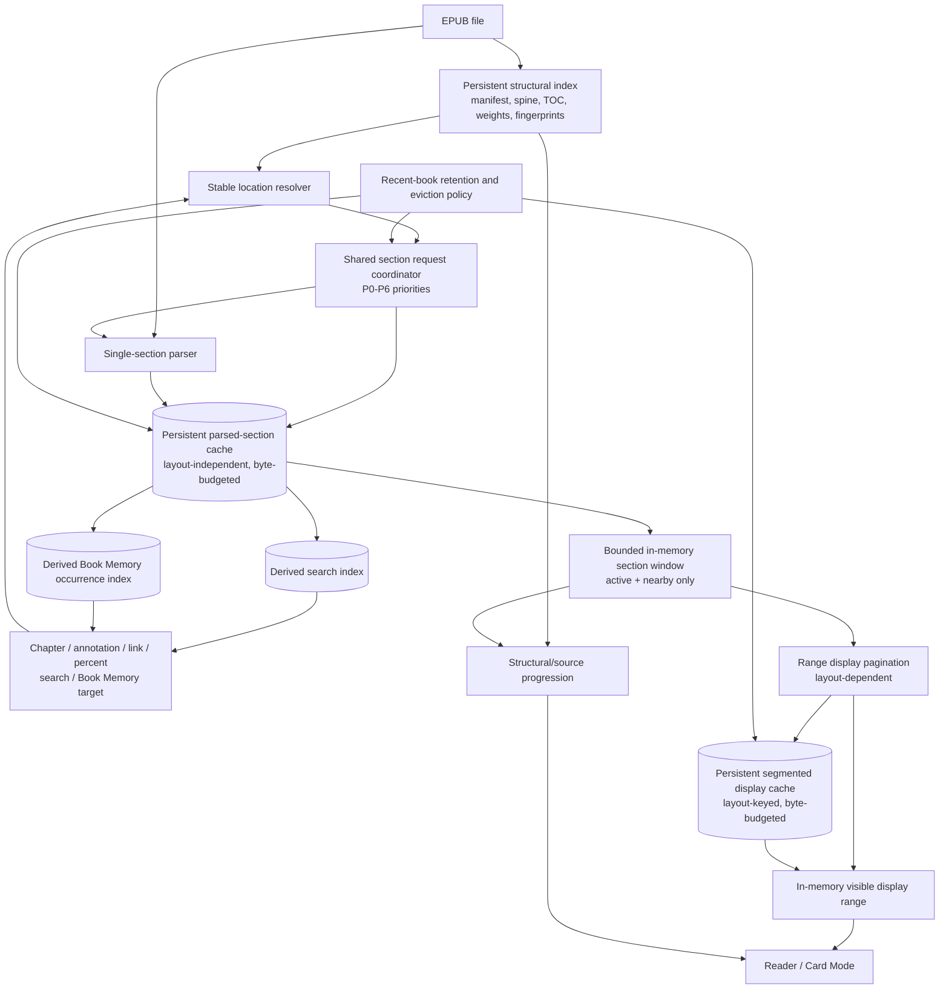

# Nalori Lazy Random-Access Reader Verification

## 1. Executive Decision

The selected architecture is **compatible with Nalori's current codebase and should be reached by incremental migration, not a reader rewrite**. The existing lazy path already has the essential mechanism: it can build a complete spine/TOC map, resolve a distant structural target, parse one XHTML resource, restore an anchor, paginate a nearby source range, and load adjacent sections without parsing intermediate sections. Focused tests confirm those mechanics.

The three largest blockers are:

1. **The structural index is transient and weakly identified.** `LazyEpubIndexService.openBookIndex` rereads the complete EPUB byte array and rebuilds archive, manifest, spine, and TOC state on every open; `bookId` is the filename, not a publication fingerprint (`lib/services/lazy_epub_index_service.dart:241-343`).
2. **`ReaderScreen` still uses a replaceable lazy window as a global coordinate system.** It rewrites section chunks into continuous window-relative `index` values, persists `_sourceChunks.length` as `totalChunks`, and uses loaded display totals for progress (`lib/screens/reader_screen.dart:5680-5790`, `7064-7119`, `9856-9875`). This blocks reliable global progress, saved-position migration, and bounded source-memory eviction.
3. **Whole-book derived features are not lazy-random-access aware.** Book Memory reads legacy `CachedBook.chunks` and `chapters`; in-reader search scans only `_sourceChunks` and returns an integer chunk index (`lib/services/book_memory_service.dart:26-71`; `lib/screens/reader_screen.dart:8097-8118`; `lib/screens/search_screen.dart:90-243`, `339-342`).

The features most exposed to regression are legacy saved positions and annotations without `stableLocation`, Book Memory source jumps, search-result jumps, global/chapter progress, position history after window replacement, and Card Mode chapter totals. Chapter-panel jumps and internal cross-section links are substantially safer because they already carry structural targets.

The safest first implementation phase is to stop avoidable legacy work while preserving explicit compatibility: record cache validity/terminal oversized outcomes, stop library refresh from automatically queueing every book, retain on-demand legacy loading for its known consumers, and add tests proving no feature silently depends on refresh-time preparsing. No location format or reader rendering behavior needs to change in that phase.

## 2. Established Context from the EPUB Parsing Audit

This report accepts the conclusions in `docs/epub_parsing_system_audit.md` and revisits them only where random access depends on them:

- Lazy reading is already the normal foreground route, but library refresh still invokes whole-library `BookPreparseService` work.
- A `CachedBook` payload above the 10 MiB whole-book cache limit is reparsed on later preparation attempts because the rejection is not persisted as a valid terminal state.
- `LazySectionRepository` ownership is per reader session; disk records can outlive a session, but in-flight parsing and write coordination are not shared across sessions.
- Parsed-section persistence and display pagination are separate systems. `ReaderScreen` owns layout-dependent display generation.
- Hydration walks the current book's readable spine in a live session and writes parsed-section records; it is not a recent-book retention scheduler.
- Parsed-section disk storage has no global byte budget, access-time LRU, or coordinated deletion policy.
- Display hydration, cancellation, lifecycle, and cache-write issues from the prior audit remain valid. This report does not repeat their general analysis.

## 3. Existing Structural Index

### Current open behavior

`LazyEpubIndexService.openBookIndex` calls `File.readAsBytes`, then `EpubReader.openBook(bytes)`, so it reads all compressed EPUB bytes and decodes the ZIP directory on every lazy open (`lib/services/lazy_epub_index_service.dart:241-248`; `packages/epubx/lib/src/epub_reader.dart:53-72`). It rebuilds manifest, spine, metadata, and chapters each time (`lib/services/lazy_epub_index_service.dart:249-343`). No structural-index read/write path exists. `LazyEpubBookHandle.readSection` subsequently materializes and UTF-8 decodes the complete target resource (`lib/services/lazy_epub_index_service.dart:143-183`; `packages/epubx/lib/src/ref_entities/epub_content_file_ref.dart:38-74`).

### Field capability

| Structural field | Classification | Current evidence | Required extension |
|---|---|---|---|
| Complete spine order | Already available and correct for valid EPUBs | `LazyEpubSpineItem.index` is constructed from package spine order (`lazy_epub_index_service.dart:41-61`, `299-323`) | Persist unchanged. |
| Spine href/full path/media type | Already available and correct | `href`, `fullPath`, `mediaType` (`lazy_epub_index_service.dart:41-61`) | Persist; add normalized-path lookup. |
| Manifest resources | Already available and correct | `LazyEpubManifestItem` has `id`, `href`, `mediaType`, `fullPath`, `sizeBytes`, `properties` (`lazy_epub_index_service.dart:23-39`, `276-297`) | Persist all items, not only spine items. |
| TOC hierarchy and labels | Already available for well-formed navigation | Recursive `LazyEpubChapter.children`, `title`, `contentFileName`, `anchor` (`lazy_epub_index_service.dart:63-75`, `379-390`) | Persist; retain malformed-navigation fallback status. |
| Chapter-to-spine mapping | Partially available | `LazyBookSession._resolveHrefToSpineIndex` derives it by href/full-path matching (`lazy_book_session.dart:365-372`) | Store normalized resolved spine index and unresolved reason. |
| TOC fragments | Already available | `LazyEpubChapter.anchor` (`lazy_epub_index_service.dart:63-75`) | Persist normalized fragment. |
| All XHTML anchors | Available only after section parsing | `ParsedSection.anchorMap` is created per parsed section (`lazy_parsed_book.dart:106-163`) | Keep section-local; optionally persist an anchor directory as sections parse. |
| Internal link targets | Available only after section parsing | Link and footnote targets live in `BookChunk`/`ParsedSection`; cross-section resolution uses href plus fragment (`reader_screen.dart:7280-7317`) | Preserve href/fragment in parsed records; do not require a whole-book link graph. |
| Uncompressed resource size | Already available | `ArchiveFile.size` becomes `sizeBytes` (`lazy_epub_index_service.dart:352-360`) | Persist as a structural weight. |
| Compressed resource size | Missing | No field in `LazyEpubManifestItem` or `LazyEpubSpineItem` | Add when archive metadata exposes it; not required for navigation. |
| Approximate text length | Partially available | XHTML uncompressed bytes are known; actual `textCharCount`/`wordCount` exist only after parse (`lazy_parsed_book.dart:106-163`) | Persist byte weight immediately and refine with parsed counts. |
| Cover | Already available | `coverHref` is found from EPUB metadata/properties (`lazy_epub_index_service.dart:392-410`) | Persist. |
| Styles/images/fonts inventory | Already available as manifest inventory | Manifest media types/properties identify resources, but not per-section dependencies (`lazy_epub_index_service.dart:23-39`) | Persist manifest; record section dependency checksums after parsing. |
| Linear/non-linear spine state | Already available | `isLinear` (`lazy_epub_index_service.dart:41-61`, `313`) | Persist and exclude non-linear items from default progression. |
| Front matter/appendix classification | Missing structurally; heuristic after indexing/parsing | `LazySectionRepository._sectionKindFor` and `ChapterNavigationService` infer from names/titles (`lazy_section_repository.dart:613-635`; `chapter_navigation_service.dart:257-307`) | Persist an explicit derived classification plus confidence; never make it identity. |
| Stable book identity | Partially available and unsafe | `bookId` is derived from the filename (`lazy_epub_index_service.dart:244-246`) | Separate logical library ID from publication fingerprint. |
| Stable section identity | Partially available | Spine index, href, full path, and XHTML CRC form `LazySectionIdentity` (`lazy_parsed_book.dart:14-63`) | Add publication fingerprint and dependency signature. |
| Approximate global progression | Missing | Lazy scrub maps directly to raw spine ordinal (`reader_screen.dart:8423-8515`) | Persist readable-spine weights and prefix sums; refine weights after parse. |
| Modification/resource identity | Partially available | Spine `sourceChecksum` uses CRC or a weak size/hash fallback (`lazy_epub_index_service.dart:363-376`) | Add file size/mtime plus archive/resource checksums and index schema version. |

### Persistence decision

Do **not** create a second parallel structural model. `LazyEpubIndex`, `LazyEpubSpineItem`, `LazyEpubManifestItem`, and `LazyEpubChapter` contain serializable primitives already (`lib/services/lazy_epub_index_service.dart:23-101`). Extend them with schema/version, publication fingerprint, file validity metadata, normalized lookup maps, resource checksums, chapter-to-spine resolution, and progression weights. Keep `LazyEpubBookHandle` as the live archive handle and keep it out of the persisted record. `LazyParsedBook.fromIndex` is a transient duplicate subset and should consume the persisted model rather than become another index (`lib/services/lazy_parsed_book.dart:166-202`).

Malformed EPUB reliability is limited by strict navigation parsing and href matching. EPUB navigation can throw when expected navigation items are absent, and current href fallback uses `endsWith`, which can be ambiguous (`packages/epubx/lib/src/readers/navigation_reader.dart:143-150`; `lib/services/lazy_book_session.dart:365-372`). Persist parse warnings and normalized canonical paths so a cached index does not preserve an unexplained bad resolution.

## 4. Stable Location Audit

`StableBookLocation` version 1 carries `bookId`, `spineIndex`, `href`, `sourceChecksum`, `internalSegmentId`, `localChunkIndex`, `textOffset`, `anchorId`, quote/context fields, `legacyGlobalChunkIndex`, `localDisplayIndex`, layout fingerprint, and neighbor spine indexes (`lib/models/stable_book_location.dart:4-45`, `89-130`). The name overstates current guarantees: production resolution primarily uses spine, anchor, and parser-generated local chunk index. `contextBefore`, `contextAfter`, and `internalSegmentId` have no production resolver. Compatibility checks ignore `sourceChecksum` (`lib/services/lazy_book_session.dart:356-363`).

### Feature-to-location-source matrix

| Feature | Canonical fields today | Fallback fields | Lazy-window/reflow survival | Required adaptation |
|---|---|---|---|---|
| Last-read | Metadata `lastReadLocation`; ReaderScreen also stores `lastReadIndex` | Legacy integer chunk index | Stable target survives window/layout changes; same-name replacement and parser chunk changes are unsafe | Validate publication/section identity; add source element/offset plus quote-context resolver. |
| Bookmark | Optional `stableLocation` | `chunkIndex`, `originalStartOffset`, preview (`models/bookmark.dart:53-143`) | New bookmarks are mostly safe; legacy bookmarks are window/global-index dependent | Migrate lazily when opened; persist stable identity on first successful resolution. |
| Highlight/note | Optional `stableLocation` plus selected text and offsets | `originalChunkIndex`, offsets (`models/highlight.dart:40-155`) | Text provides a good fallback, but current jump uses legacy index when stable data is absent | Add quote/context search within resolved section and confidence handling. |
| Saved word | Optional `stableLocation` plus word/context | Original chunk/offset (`models/saved_word.dart:5-85`) | Same limitation as highlights | Preserve stable target in Book Memory preview contract. |
| Chapter target | Spine/href/anchor in `StableBookLocation` | Synthetic chunk index | Safe across layout and unloaded windows | Persist normalized chapter-to-spine mapping; remove synthetic index as navigation truth. |
| Reading percentage | Display/window counts or raw spine ordinal | Metadata `lastReadIndex/totalChunks` | Not globally accurate in lazy mode | Use weighted readable-spine prefix plus in-section progression; refine after parse. |
| Chapter progress | Stable chapter boundaries plus rendered display ranges | Whole-window fallback | Partial mode is safe when boundaries exist; malformed/no-TOC fallback can claim exactness | Use structural/source boundary and explicit unknown denominator. |
| Card Mode position | Source stable target plus local display index/layout fingerprint | Display-card index | Stable source restoration is viable; display fallback is invalid after typography changes | Restore source first, regenerate nearby cards, use display index only for same layout key. |
| Search result | Integer chunk index only | None | Fails after window replacement and cannot target unloaded sections | Result must carry a stable source target and publication identity. |
| Book Memory destination | Legacy original chunk index | Annotation text/offset in some sources | Lazy route can open the last-read section then clamp the unrelated global index | Carry source record's existing stable target; migrate character occurrences. |
| Internal link | Href + fragment resolved to spine/anchor | Current loaded `anchorMap` | Cross-section links are lazy-safe for spined resources | Normalize paths and define behavior for non-spine resources/missing fragments. |
| Footnote/return | Parsed `FootnoteRef`; unresolved links use href/fragment | No persistent return stack contract | Bottom-sheet footnotes need no jump; cross-section link can jump, but return history is index-fragile | Store both endpoints as stable targets in history. |
| Back history | In-memory `ReadingPosition.stableLocation` | Persisted chunk/display indexes | In-memory object can be stable, but persistence drops it and pop ignores it (`reader_screen.dart:7168-7201`, `7257-7276`) | Persist and navigate by stable target first. |

### Stability by change

- **Close/reopen and window eviction:** spine/href/anchor survive; display and loaded-window indexes do not.
- **Font, viewport, margin, line-height, or Card Mode changes:** source fields survive; `localDisplayIndex` only applies when `readerLayoutFingerprint` matches.
- **Parser-version or section chunk-count changes:** `localChunkIndex` is not stable enough. Exact anchors survive; quote/context can become the fallback only after a real section-wide resolver is implemented.
- **EPUB replacement under the same filename:** unsafe today because `bookId` is filename-based and requested-location compatibility ignores the checksum.
- **Section checksum changes:** stored but not enforced by `LazyBookSession._isLocationCompatible`.

The canonical future identity should be: logical book ID + publication fingerprint + normalized spine index/href + optional anchor + stable source-element/block identity and source offset. Quote/context, in-section progression, and weighted whole-book progression are ordered fallbacks. Legacy global chunk and display indexes remain migration hints only.

## 5. ReaderScreen Whole-Book Assumptions

| Assumption or Code Path | Current Source of Truth | Lazy-Safe? | Failure Scenario | Required Adaptation |
|---|---|---|---|---|
| Source indexes are globally continuous | Window chunks are reindexed during append/prepend (`reader_screen.dart:5680-5769`) | Incorrect but masked | Eviction/replacement changes the same content's index | Keep section-local source indexes; adapt UI maps to section-aware keys. |
| `totalChunks` is the publication | `_sourceChunks.length` is persisted (`reader_screen.dart:7064-7119`) | Blocking accurate progress | A one-section window becomes the library's book total | Persist stable source progression separately; never write window length as total. |
| Display list is a whole-book denominator | Bottom bar uses `_displayChunks.length` when complete (`reader_screen.dart:9856-9875`) | Blocking accurate progress | A complete window displays as a complete book | Use structural global progression; label exact local display totals narrowly. |
| Loaded chapters equal publication chapters | Window has structural chapters but synthetic unloaded indexes (`lazy_book_session.dart:283-306`, `375-378`) | Compatibility bridge | Index consumers treat million-spaced synthetic values as real | Use stable chapter targets exclusively. |
| Sequential reading may retain all passed sections | Append/prepend grows `_sourceChunks`; repository eviction does not remove ReaderScreen copies (`reader_screen.dart:5428-5590`) | Blocking cache eviction | Long reading session accumulates source/display chunks | Make ReaderScreen consume a bounded section window and persist source anchor before replacement. |
| Distant target can be resolved from current maps | `_navigateToStableLocation` falls back to `session.loadAround` (`reader_screen.dart:5810-5889`) | Already lazy-safe | None for valid spine targets | Retain and publish target section directly; improve exact source resolver. |
| Chapter-panel jump needs loaded chunks | Stable chapter target is built structurally (`reader_screen.dart:8840-8887`, `9768-9853`) | Safe because stable | Malformed/unmapped TOC href | Persist normalized chapter mapping and unresolved state. |
| Previous/next chapter is adjacent loaded content | `ChapterNavigationService` compares stable targets (`chapter_navigation_service.dart:125-234`) | Already lazy-safe | Heuristic non-selectable front/appendix entry is skipped unexpectedly | Separate UI classification from structural navigability. |
| Direct Continue can clamp a global index into window | Initial target clamps metadata index to `_sourceChunks.length` (`reader_screen.dart:1667-1751`) | Incorrect but masked | Legacy/global position opens wrong paragraph in a small window | Resolve legacy ratios through structural weights once, then persist stable location. |
| Restore uses current-window local chunk | `_resolveSourceIndexForStableLocation` checks anchor/local chunk (`reader_screen.dart:6551-6577`) | Medium risk | Parser changes local chunk partition; missing anchor falls to first section chunk | Add source-element and quote/context resolution across the section. |
| Percentage jump equals raw spine ordinal | Lazy scrub maps slider to spine count (`reader_screen.dart:8423-8515`) | Approximate only | Giant and tiny sections receive equal weight; non-linear items distort progress | Use readable-spine byte/text weights and prefix sums. |
| Annotation jump can use legacy integer | Annotation panel prefers stable, falls back to chunk (`reader_screen.dart:8121-8188`) | Compatibility bridge | Legacy target not in window | Invoke legacy migration resolver, not clamp/current indexes. |
| Internal target is in current anchor map | Link handler falls back to session structural resolution (`reader_screen.dart:7280-7317`) | Already lazy-safe | Target is a non-spine resource or malformed href | Normalize resource targets; explicit unsupported/missing behavior. |
| Back history can use display/source integer | Persisted history excludes stable location; pop ignores it (`reader_screen.dart:7168-7201`, `7257-7276`) | Blocking random return | Footnote/distant jump replaces window, then Back goes to wrong content | Persist and navigate stable endpoints. |
| Search can inspect loaded chunks | Search receives `_sourceChunks` and window index (`reader_screen.dart:8097-8118`) | Blocking arbitrary random access | Query misses every unloaded section | Add incremental whole-book derived search index. |
| Display generation represents a book | `_displayChunksComplete` actually means current source generation complete | Incorrect but masked | Global UI uses it as book-complete | Rename/scope completeness to range/window and keep global progress structural. |
| Card chapter total should be completed eagerly | Card completion walks forward to next chapter boundary (`reader_screen.dart:6845-6955`) | Blocking responsiveness | Long chapter causes many section parses/pagination before exact denominator | Permit `n / ?`; compute exact totals only from already-needed/persisted layout ranges. |
| Current chapter title needs loaded boundary indexes | Service uses stable chapter targets with display/source mappings (`card_depth_chapter_progress_service.dart:23-140`) | Mostly lazy-safe | No TOC or unresolved target triggers whole-window fallback | Fall back to structural spine label and unknown progress, not exact window total. |
| Settings require a book rebuild | Settings trigger display generation only (`reader_screen.dart:438-450`, `9523-9623`) | Already compatible | Old split cards briefly render under new typography before replacement | Preserve source anchor and publish first newly laid-out card atomically. |

## 6. Random-Access Navigation Traces

### Current general path



This already avoids intermediate-section loading (`LazyBookSession.loadAround`, `lib/services/lazy_book_session.dart:82-120`; `ReaderScreen._navigateToStableLocation`, `lib/screens/reader_screen.dart:5810-5889`). Its main latency defects are that a cache miss still reuses a live full-archive handle, a distant jump clears current display state, source resolution can be approximate, and one giant XHTML is indivisible.

### Action-by-action current trace

| Action | Current call chain and target knowledge | Loaded requirement / latency / cache behavior |
|---|---|---|
| Chapter panel | panel callback -> `ChapterNavigationTarget.stableLocation` -> `_navigateToStableLocation` (`reader_screen.dart:9768-9853`) | Knows spine/href/TOC anchor; direct window replacement; parsed-section disk then parse; nearby display only. |
| Anchor in chapter | `_onLinkTap` -> current `anchorMap` or `session.resolveAnchor` -> stable jump (`reader_screen.dart:7280-7317`) | Target need not be loaded; exact when parsed anchor exists; no intermediates. |
| Bookmark | annotation panel -> stable jump, else legacy chunk (`reader_screen.dart:8121-8188`) | New records usually direct; legacy record requires loaded/global compatibility. |
| Highlight | same annotation panel path | Stable record direct; quote is not yet used as a section-wide resolver. |
| Note | same `Highlight` path | Same behavior as highlight. |
| Internal link | href/fragment -> structural spine resolution -> target parse | Direct for spined XHTML; unresolved/non-spine behavior is incomplete. |
| Footnote and return | parsed `FootnoteRef` opens a bottom sheet; unresolved href can use internal link path (`widgets/reading_card.dart:1491-1516`) | Inline sheet is immediate; cross-section jump can be direct, but persistent return history is not stable-safe. |
| Resume stable location | `ReaderOpenService.openLazy` -> `_resolveInitialLocation` -> `session.loadAround` (`reader_open_service.dart:77-190`, `218-247`) | Opens target section only. Legacy fallback distributes old index uniformly across spines, so it is approximate. |
| Whole-book percentage | lazy scrub -> ratio to raw spine -> stable section-start jump (`reader_screen.dart:8423-8515`) | Direct and no intermediates, but unweighted and usually section-start approximate. |
| Search result | current-window search -> integer chunk -> local navigation (`reader_screen.dart:8097-8118`; `search_screen.dart:339-342`) | Requires result section already loaded because unloaded content is not searched. |
| Book Memory reference | `_openChunk` -> `BookLoadingScreen(initialChunkIndex)` (`book_memory_screen.dart:82-99`) | Legacy route works with whole chunks; lazy route opens last-read context and clamps an unrelated global integer, so arbitrary references are unreliable. |
| Backward unloaded section | boundary -> `loadPreviousSection` -> prepend/integrate (`reader_screen.dart:5039-5075`, `5490-5590`) | Loads only previous readable spine; incremental when display maps permit, otherwise clears/rebuilds. |

`ReaderOpenService` initially requests only the target section (`after: 0`), then ReaderScreen paginates a bounded source range and warms adjacent sections (`reader_open_service.dart:119-128`; `reader_screen.dart:4000-4231`, `5931-5949`). First visible latency is therefore index-open + cache read or one full-XHTML parse + nearby pagination. It is not blocked by unrelated whole-book pagination, except Card Mode's optional exact-chapter completion path can later create such work.

### Desired path



Existing portions are the structural target model, direct `loadAround`, section cache lookup, isolated parse, anchor map, bounded initial pagination, and adjacent warmup. Missing portions are persistent index reuse, strong identity/validity, a shared request scheduler, parser-independent source resolution, atomic first-card replacement, and stable derived-feature destinations.

## 7. Parsed-Section Cache Suitability

### Layout independence

`ParsedSection` stores `identity`, `chunks`, `anchorMap`, `chapters`, `wordCount`, `textCharCount`, `resourceHrefs`, and `parserVersion` (`lib/services/lazy_parsed_book.dart:106-163`). `BookChunk` stores source text, images, source links, publisher semantics, footnotes, source file, and source-derived styling metadata (`lib/models/book_chunk.dart:195-258`, `444-523`). No record field depends on reader font size/family/weight, text scale, viewport, margins, line height, paragraph spacing, density, Card Mode, Card depth, or display pagination. The cache is therefore suitable as a layout-independent source cache.

Publisher inline semantics are legitimately source-dependent, not reader-layout-dependent. External stylesheet content is not currently loaded by `parseLazySection`; the synthetic section book supplies empty external CSS/font maps (`lib/services/epub_parser.dart:302-372`). If external CSS support is added, its checksum must join cache validity.

### Current identity and validity

| Identity input | Current status | Gap |
|---|---|---|
| Book identity | `bookId`, filename-derived | Collides across replacement/same-name imports. |
| EPUB modification identity | Not a cache-key component | No file fingerprint or archive signature. |
| Spine/href/full path | In `LazySectionIdentity` | Good structural scope. |
| XHTML checksum | `sourceChecksum`; record `matches` checks it (`parsed_section_cache_service.dart:64-70`) | Strong when CRC exists; fallback is weak. |
| Parser version | `section_v2`; checked on read (`lazy_parsed_book.dart:8-10`) | Good; retain schema and parser version separately. |
| Linked images | Only href list/embedded parsed bytes | Image replacement does not invalidate unchanged XHTML. |
| Linked footnotes | Parsed selectively into chunks | Target XHTML change does not invalidate source section. |
| Stylesheet influence | Not represented | Currently mostly moot because external CSS is ignored; required before CSS-aware parsing. |
| Manifest/navigation influence | Not represented | Classification and target resolution can change without XHTML CRC change. |

The repository loads a retained section, joins only its own instance's in-flight job, then checks disk before parsing (`lib/services/lazy_section_repository.dart:122-245`). It reads the complete XHTML and referenced resources on a miss (`lazy_section_repository.dart:456-541`). Completed records can be shared safely as immutable serialized data, but cross-session parse/write coordination is absent.

`ParsedSectionCacheService` has manifests and atomic payload writes, validates payload checksum, and supports `deleteForBook` including hydration state (`lib/services/parsed_section_cache_service.dart:275-324`, `377-495`). It has no global byte budget, eviction, or last-access update. Record timestamps are creation/update timestamps rather than use timestamps. The repository's in-memory LRU is only three sections/6 MiB per session (`lazy_section_repository.dart:47-80`, `333-385`).

Minimum extensions:

1. Add publication fingerprint, cache schema, and resource-dependency checksums to record identity.
2. Permit structural-index and parsed-record lookup before opening a live archive; open the archive only on a miss requiring source bytes.
3. Move in-flight section jobs and writes behind a process-wide coordinator keyed by full identity.
4. Record payload byte size and last access, enforce a configurable global byte budget, and pin active/adjacent records rather than whole books.
5. Coordinate book deletion across parsed payload, hydration state, segmented/whole display cache, derived indexes, and temporary files.

## 8. Display and Settings Behaviour

Reader settings and parsed source are already separated. `readerSettingsRequireDisplayChunkRebuild` identifies layout-affecting settings, while `_ensureDisplayChunksBuilt` derives a layout key/signature and rebuilds display state without asking `LazyBookSession` to reload source (`lib/screens/reader_screen.dart:438-450`, `2004-2141`).

| Change | Source parse/window reload | Display work | Current behavior and cache-key evidence |
|---|---|---|---|
| Font size | No | Regenerate nearby display range | In rebuild predicate and layout key (`reader_screen.dart:438-450`, `2023-2089`). |
| Font family | No | Same | Keyed; parsed source reused. |
| Font weight | No | Same | Keyed; parsed source reused. |
| Line height | No | Same | Keyed; parsed source reused. |
| Paragraph spacing | No | Same | Keyed; parsed source reused. |
| Side margins | No | Same | Keyed; changes available width. |
| Content density | No | Same | Keyed; affects splitting/layout. |
| Text scale | No | Same | MediaQuery-derived signature changes (`reader_screen.dart:2041-2089`, `9108-9113`). |
| Orientation/screen dimensions | No | Same | Viewport signature changes. |
| Safe-area dimensions | No | Same | Safe-area inputs participate in display identity. |
| Card Mode | No source parse | Display/navigation presentation changes; layout reserve can change | Display remains source-derived locally; no whole-book parse. |
| Card depth | No | Rebuild card layout and possibly request chapter-boundary completion | Rebuild predicate includes Card Depth; exact-progress warmup can overreach (`reader_screen.dart:6845-6955`). |

The initial lazy display range is bounded to roughly eight source chunks behind and 39 ahead, at least 48 where available (`reader_screen.dart:4000-4023`). Segmented cache loading requests a center segment plus neighbors; on a miss, progressive generation publishes the initial range before later work (`reader_screen.dart:4024-4231`). This is nearby/window work, not whole-book repagination.

During a settings update, ReaderScreen records a text/page anchor, applies the setting immediately, debounces for 300 ms, then regenerates (`reader_screen.dart:9523-9623`). Old visible display chunks are retained until replacement, but the new typography can temporarily render against old split boundaries; the first progressive replacement can still visibly move. Distant navigation is worse: `_navigateToStableLocation` clears display maps before the target generation, causing a full preparing state (`reader_screen.dart:5810-5889`, `9090-9157`).

The target six-step behavior is feasible with current components: retain parsed source, capture stable source anchor, generate the containing replacement card first, atomically publish it, paginate a small surrounding range, then warm more. It requires range-scoped generation ownership and an atomic visible-generation swap. Old layout ranges may remain in `SegmentedDisplayCacheService` under their layout keys; the in-memory cache is reader-scoped and cleared on replacement/dispose (`lib/services/display_section_memory_cache.dart:64-160`). Segmented eviction is write-time based rather than read-access based (`lib/services/segmented_display_cache_service.dart:970-1014`) and should gain access tracking.

## 9. Hydration and Priority Policy

Current hydration starts only after the first display is ready, backward and forward adjacent warmup has run, and a 16 ms schedule plus 900 ms foreground quiet period has elapsed (`lib/screens/reader_screen.dart:5931-5949`; `lib/services/lazy_section_repository.dart:262-314`). It traverses all readable linear spine items radially from the current section and resumes from a persisted hydration manifest. It does not prioritize chapter starts, cannot run without the live reader/archive session, and cannot hydrate recent books after close.

Pause/cancellation behavior is coarse: it yields between sections while foreground section/display work is active, but does not preempt a running isolate parse, pause for general interaction, react to thermal/battery/I/O policy, or integrate app background state. Reader close prevents subsequent sections; an already-running parse can complete and write. Resource priorities exist (`explicitNavigation`, `adjacentReadiness`, `boundaryPrefetch`, `recentRetention`, `parsedHydration`, `layoutPagination`) but only annotate/join repository work; there is no central priority queue (`lib/services/lazy_section_repository.dart:32-45`, `172-245`).

### Work classification

| Current work | Classification | Decision |
|---|---|---|
| Explicit target parse | Foreground-required | P0, preempts queued speculation. |
| Visible section cache read/parse | Foreground-required | P1 immediately after P0 resolution. |
| Previous/next section warmup | Adjacent warmup | P2, byte/interaction aware. |
| Card exact chapter-boundary walk | Current-book speculative, often unnecessary | Do not force for exact denominator. |
| Radial all-linear-spine hydration | Whole-book idle preparation | Keep as optional P4 cache work under budget, not a requirement for navigation. |
| Duplicate session request | Unnecessary duplication | Join process-wide job by full identity. |
| Completed immutable section record | Safe reusable cache work | Share across sessions/books by policy. |

Recommended policy:

- **P0:** explicit chapter, annotation, link, percentage, search, or Book Memory target.
- **P1:** currently visible section and source-anchor resolution.
- **P2:** next/previous readable section and cards required for swipe depth.
- **P3:** selected navigation target preview/chapter start not yet committed.
- **P4:** current-book idle hydration, smallest/nearest useful items first and giant sections skipped unless requested.
- **P5:** recent-book idle hydration only when a retained index/archive is available and policy permits; never keep a live session solely for it.
- **P6:** derived search/Book Memory indexing, resumable and independently invalidated.

Reuse the existing priority enum and repository join semantics, but put them behind a shared scheduler with cancellation tokens, lifecycle state, foreground-display pressure, byte estimates, and one-at-a-time parse limits on constrained devices.

## 10. Recent-Book Retention Design

`BookMetadata` records filename-derived ID, last read index/location, total chunks, and `lastReadTime`; metadata creation defaults `lastReadTime` to now (`lib/models/book_metadata.dart:153-218`, `220-294`). `BookMetadataService.getAllSortedByLastRead` sorts it (`lib/services/book_metadata_service.dart:80-85`). Reader persistence updates it on reading (`lib/screens/reader_screen.dart:7064-7119`). Home treats `lastReadIndex > 0` as meaningful reading (`lib/screens/home_screen.dart:63-100`). Therefore active book is known from the live route, and two meaningfully read recent books can be approximated, but imported-never-read and opened-without-progress books are not cleanly distinguished. Add `lastOpenedAt` and `lastMeaningfulReadAt`; retain `lastReadTime` for migration.

### Byte-budgeted tiers

| Tier | Always retained | Parsed-source retention | Display retention |
|---|---|---|---|
| All library books | Compact structural index, annotations, metadata, cache-validity state | Eligible but unprotected under pressure | None guaranteed. |
| Active book | Structural index pinned | Current section plus adjacent/visited records protected within active share; only active/nearby sections in memory | Current layout's visible and nearby ranges pinned. |
| Two most recently meaningfully read | Structural index | Last-visible and adjacent records protected first; other visited records retained only while budget permits | Last-visible nearby range may remain on disk; none in memory. |
| Recently opened, not meaningfully read | Structural index | No special protection beyond cache recency | No special protection. |
| Cold books | Structural index | Opportunistic records evicted by byte/access pressure | Evict first. |

A reasonable configurable starting envelope is 128-256 MiB for parsed source and 32-64 MiB for display ranges, adjusted by platform/storage class; these are not product constants. Allocate by actual payload bytes, not book count. Large books consume their fair byte share rather than receiving whole-book protection.

Evict obsolete layout/display ranges first, then cold parsed sections, then non-adjacent recent sections. Protect the active target/adjacent source records and never evict structural indexes, annotations, or reading positions as cache cleanup. Under low storage, stop P4-P6 work, reduce recent protections, and retain only active nearby parsed source. Do not retain sessions or whole books in memory.

## 11. Book Memory Migration

`BookMemoryService.load` reads metadata, bookmarks, highlights, saved words, entries, and `BookCacheService.loadCachedBook` (`lib/services/book_memory_service.dart:26-71`). From `CachedBook` it consumes:

- `chapters` for labels/hierarchy in the snapshot.
- `chunks` to scan character aliases and calculate first/last/count (`book_memory_service.dart:74-170`).
- Chunk order plus `metadata.lastReadIndex/totalChunks` to classify read/unread and spoiler boundaries (`book_memory_service.dart:240-395`).

It does **not** require complete pagination, display chunks, images, anchors as a whole-book map, or the legacy search index. Existing annotations and manual memory entries load even when `CachedBook` is absent; the missing material behavior is structural chapter labeling and refreshed character occurrence coverage.

Current character occurrence persistence stores global `chunkIndex`, start/end, and text, without stable identity (`lib/services/book_character_occurrence_service.dart:103-130`). Book Memory UI previews reduce sources to original chunk/offset and navigate via `BookLoadingScreen(initialChunkIndex)` (`lib/screens/book_memory_screen.dart:82-99`; `lib/screens/book_memory_writing_screen.dart:11-38`). This is a hard random-access bug in lazy mode, because `BookLoadingScreen` passes the integer while lazy open is centered on last read (`lib/screens/book_loading_screen.dart:153-197`).

### Replacement contract

```text
BookMemorySourceRecord
  bookId, publicationFingerprint, sourceType, sourceId
  StableBookLocation location
  quote, contextBefore, contextAfter, startOffset, endOffset
  structuralChapterId/title, globalSourceProgression
  note/color/timestamp

CharacterOccurrenceSectionRecord
  publicationFingerprint, spineIndex, href, sectionChecksum
  parserVersion, occurrenceIndexVersion
  aliases -> count + firstStableLocation + lastStableLocation

BookMemoryBookView
  metadata + stableLastRead + structuralChapters
  annotation source records + manual entries
  occurrence aggregates + indexed-section coverage/completeness
```

Future sources are: annotations directly; chapter hierarchy from the persistent structural index; occurrences from parsed-section records, on-demand P6 parsing, and a compact per-section derived occurrence index. Aggregates must expose coverage. Previously visited sections may provide a partial result, but exact book-wide first/last/count cannot be claimed until all readable sections are indexed. Book Memory can therefore combine options 1, 2, 3, and 4 from the requested analysis rather than require eager whole-book parsing.

Book Memory is the only production feature with a material, direct `CachedBook` read besides the legacy reader route. Library card summary has a compatibility fallback to cached book data (`lib/screens/book_list_screen.dart:3576-3606`) but can use metadata/structural aggregates. Thus Book Memory is the main feature dependency sustaining automatic preparation, while legacy routes remain an explicit compatibility dependency.

## 12. Search Migration

`SearchScreen` receives a list of chunks and word-to-chunk index, scans those chunks in batches, and returns only an integer chunk index (`lib/screens/search_screen.dart:9-37`, `90-243`, `339-342`). Lazy `ReaderScreen` supplies `_sourceChunks` and `_sourceSearchIndex`, both limited to the current accumulated window (`lib/screens/reader_screen.dart:8097-8118`). The legacy reader happens to search the whole book because its source list came from `CachedBook`. There is no persistent whole-book lazy search index.

Search is layout-independent, but whole-book completeness currently requires every section to have been parsed into the legacy chunk list. Results cannot reliably open an unloaded section because they do not carry spine/href/anchor/stable source identity.

Recommended compact record:

```text
SearchRecord
  bookId, publicationFingerprint
  spineIndex, href, sectionChecksum, parserVersion
  paragraphOrSourceId, localSourceOffset, anchor
  normalizedTextOrTokens, preview
  StableBookLocation target, globalSourceProgression
```

Use a dedicated incremental derived index, preferably the existing SQLite/FTS capability rather than loading and decoding every parsed JSON section per query. Update/delete a section transactionally when its full cache identity changes. A direct scan of already-retained parsed sections is an acceptable fallback for tiny books or partial early results, but it cannot provide instant complete search for a cold book without parsing missing sections. Results should stream with explicit coverage while P6 indexing fills gaps, and every result must invoke the same P0 direct target-section flow as chapter navigation.

## 13. Card Mode Compatibility

`ReadingCardDeck` needs the current card, two forward depth cards, and a previous card during backward drag; it does not intrinsically require a full chapter or book (`lib/widgets/reading_card_deck.dart:375-429`). The minimum source/display range is therefore the source containing those cards, enough previous content for one backward destination, enough forward content for the depth stack and next swipe, plus structural next/previous chapter boundaries.

With the current parser, Card Mode does require the **complete target XHTML section to be parsed**, but not every section in the chapter, complete chapter pagination, or complete book totals. Image/table data needed by the target cards is produced with that section and may delay the first affected card's layout; it does not justify measuring unrelated cards or the full chapter (`lib/services/lazy_section_repository.dart:172-245`, `456-541`; `lib/services/epub_parser.dart:302-372`). Cross-section merging is handled as adjacent window/display integration, while global source/display indexes are compatibility artifacts rather than an intrinsic deck requirement.

`CardDepthChapterProgressService` already uses stable chapter targets and reports partial progress as `n / ?`, capped below 100%, until the next chapter target or a genuinely complete display generation proves the denominator (`lib/services/card_depth_chapter_progress_service.dart:23-140`). This is compatible. Two adaptations are required:

1. `ReaderScreen._maybeRequestCardDepthChapterCompletion` currently walks section-by-section and paginates toward the next chapter solely to obtain an exact denominator (`reader_screen.dart:6845-6955`). Exact progress must not create whole-chapter foreground work.
2. The service's whole-window fallback can treat the loaded window as exact when structural targets are missing (`card_depth_chapter_progress_service.dart:262-330`). In lazy mode it must show unknown/approximate source progress instead.

| State | Required behavior |
|---|---|
| Target chapter not parsed | P0 load its first/anchored section, resolve source target, paginate current plus depth range, publish. |
| Parsed but not paginated | Reuse source record; paginate target-containing card first. |
| Partial chapter display exists | Show current/depth/swipe cards; report `n / ?` or structural source percentage. |
| Next section absent | Request P2 before boundary; show stable current card while waiting. |
| Exact card total unknown | Never use loaded range as total and never force chapter completion. |
| Distant chapter jump | Replace bounded source window directly; no intermediate parse. |
| Typography change | Preserve stable source anchor; regenerate current and depth cards under new layout key, then warm. |

Current card/chapter label should derive from stable chapter boundaries. Global progress should derive from weighted structural + in-section source progression. Exact display totals are valid only for an explicitly complete chapter under one layout key. Approximate section weights are valid for scrubbing/progression but must not be presented as an exact card denominator.

## 14. Giant XHTML Edge Case

Repository fixtures expose the failure mode. ZIP inventory inspection found:

| EPUB | Largest XHTML | Uncompressed | Compressed |
|---|---|---:|---:|
| `Dialogues -- Plato.epub` | `epub/text/laws.xhtml` | 1,725,278 bytes | 491,341 bytes |
| `test/fixtures/books/feature_rich_lazy_reader.epub` | `EPUB/text/chapter-2.xhtml` | 6,851 bytes | 596 bytes |

The existing runtime diagnostic records 7,328 parsed chunks for `republic.xhtml` and 2,560 for `laws.xhtml` (`docs/diagnostics/large_epub_parsing_investigation.md:82-94`, `176-179`). Thus the largest parsed section by observed chunk count is `republic.xhtml`, even though `laws.xhtml` is larger in raw bytes. The sample Plato book has only a few very large main XHTML resources, so one lazy request can still represent a large fraction of a book.

On a miss, resource bytes are fully materialized and UTF-8 decoded, `extractSectionResourceHrefs` builds a DOM, and `parseLazySection` builds another complete DOM/synthetic book representation (`epub_content_file_ref.dart:38-74`; `epub_parser.dart:895-906`, `1515-1528`). Parsing runs in a compute isolate but has no block-level yield/cancel checkpoint once dispatched. Reader close cannot preempt that parse.

The initial architecture can ship without subsection parsing **only if** explicit target latency is accepted as a known edge case, giant sections are excluded from speculative hydration/Card-total work, byte/chunk latency is measured, and no UI equates “one section” with “small.” Otherwise large single-resource books will still pause on first access.

A future-compatible subsection identity should be:

```text
(publicationFingerprint, spineIndex, normalizedHref, xhtmlChecksum,
 subdivisionVersion, blockStartOrdinal, blockEndOrdinal,
 firstAnchor, lastAnchor)
```

`StableBookLocation.internalSegmentId` can carry the subdivision identifier after its resolver is implemented. Split only at parsed block-element/source boundaries, not arbitrary bytes. Maintain an anchor-to-subsection directory, source offsets/element IDs across boundaries, and dependency checksums for images, linked footnotes, and CSS. Cross-block tables/lists, footnotes, publisher styles, and image measurement make subdivision nontrivial; it is a future optimization, not a Phase 1 prerequisite.

## 15. Legacy Compatibility Matrix

| Legacy dependency | Current consumer/evidence | Classification | Removal boundary |
|---|---|---|---|
| `BookPreparseService` whole-library queue | Library refresh queues books (`book_list_screen.dart:161-168`) | Replaceable immediately as automatic work | Phase 1 after explicit compatibility entry points are retained. |
| Oversized `CachedBook` retry | Cache rejection lacks terminal valid state (established audit) | Replaceable immediately | Phase 1. |
| Foreground legacy loading | `BookLoadingScreen` calls legacy `ensureParsed` when route/position requires it (`book_loading_screen.dart:120-150`, `215-270`) | Required temporarily | After stable-position migration and route evidence. |
| `CachedBook.chunks` for Book Memory | `BookMemoryService.load` (`book_memory_service.dart:26-71`) | Replaceable after Book Memory migration | Phase 6. |
| `CachedBook.chapters` for Book Memory | Same | Replaceable after persistent structural index | Phase 6 contract rollout. |
| Cached summary fallback | Book list reads cached book summary (`book_list_screen.dart:3576-3606`) | Replaceable immediately | Structural/metadata aggregate available. |
| Legacy chunk indexes | Metadata, old annotations, character occurrences | Required only for legacy saved-position migration | Retain as fallback through Phase 7. |
| Legacy whole-book search list/index | Legacy ReaderScreen source | Replaceable after search migration | Phase 6. |
| Whole display cache | Reader display compatibility lookup | Required temporarily | Remove after segmented cache correctness/access policy evidence. |
| Legacy parser code | Explicit legacy routes and migrations | Required temporarily | Do not delete before all above consumers and migrations exit. |

Phase 1 may disable refresh-time automatic preparsing and unchanged oversized retries. It must not remove explicit legacy `BookLoadingScreen` loading or Book Memory compatibility. Until the derived Book Memory index exists, entering Book Memory may explicitly request legacy preparation as a temporary compatibility operation; it must not be disguised as library-wide maintenance.

## 16. Target Architecture



Complete navigation comes from the persistent structural index and stable resolver. Parsed source caching is independent from layout. Display pagination is a bounded, disposable derivative. The in-memory window is not the publication model. Search and Book Memory are compact derived indexes with section-level coverage and invalidation.

## 17. Existing-to-Target Component Mapping

| Target Responsibility | Existing Component | Reuse As-Is | Extend | Replace | New Component Needed | Notes |
|---|---|---:|---:|---:|---:|---|
| Persistent structural index | `LazyEpubIndexService`, `LazyEpubIndex` |  | Yes |  | Persistence adapter only | Serialize/validate existing model; no parallel index. |
| Stable location resolver | `StableBookLocation`, `LazyBookSession`, `ChapterNavigationService` |  | Yes |  | No | Add publication/source-element identity and ranked fallback. |
| Section request coordinator | `LazySectionRepository` priority/in-flight logic |  | Yes |  | Shared backend/queue | Promote per-session job map to process-wide keyed coordination. |
| Parsed-section cache | `ParsedSectionCacheService` |  | Yes |  | No | Add dependency identity, access bytes/budget, coordinated writes. |
| In-memory section window | `LazyBookSession` + ReaderScreen source arrays |  | Yes | ReaderScreen accumulation | No | Session window becomes authoritative and bounded. |
| Background hydration | Repository hydration + ReaderScreen triggers |  | Yes |  | Scheduler shared with coordinator | P4/P5/P6, lifecycle/resource aware. |
| Recent-book policy | Metadata timestamps + caches |  | Yes |  | Cache retention policy | Add opened/meaningful-read timestamps and byte-tier decisions. |
| Display pagination | ReaderScreen progressive generator | Mostly | Yes |  | No | Target-containing first card and range ownership. |
| Display cache | `SegmentedDisplayCacheService`, `DisplaySectionMemoryCache` |  | Yes | Whole cache later | No | Add access LRU/pins; keep layout key separation. |
| Search index | Window search map / legacy chunk scan |  |  | Yes | Derived FTS index | Section-checksum incremental records and stable results. |
| Book Memory index | `BookMemoryService`, occurrence service |  | Yes | CachedBook scan | Derived occurrence records | Annotations remain direct; structural chapters from index. |
| Cache eviction | Segmented display eviction + repository memory LRU |  | Yes |  | Cross-cache policy coordinator | Parsed disk eviction is missing. |
| Cache deletion | Individual `deleteForBook` APIs |  | Yes |  | No | One deletion transaction invokes every cache/index owner. |
| Route selection | `BookLoadingScreen`, `ReaderOpenService` |  | Yes | Legacy default later | No | Stable target must reach open service for every feature. |
| Progress calculation | Card progress service + ReaderScreen counters |  | Yes | Window/global counters | Structural progression calculator | Exact display progress remains local/layout-scoped. |
| Card Mode navigation | `ReadingCardDeck`, Card progress service, ReaderScreen warmup | Mostly | Yes | Forced chapter completion | No | Minimum current + two forward + one back display range. |

## 18. Findings

1. **Classification: Already compatible.** **Evidence:** `LazyBookSession.loadAround` loads the target spine directly and `ReaderScreen._navigateToStableLocation` replaces the window without loading intermediates (`lazy_book_session.dart:82-120`; `reader_screen.dart:5810-5889`). **Affected:** chapters, valid internal links, stable resume. **Consequence:** distant structural navigation can already be bounded. **Adaptation:** preserve this call chain behind persistent index lookup. **Confidence:** High. **Instrumentation:** No.

2. **Classification: Confirmed blocker.** **Evidence:** every lazy open reads the full file bytes and rebuilds archive/index/TOC; no persisted structural record exists (`lazy_epub_index_service.dart:241-343`). **Affected:** open/reopen, every arbitrary jump requiring a new session. **Consequence:** complete navigation is not instantly reusable across sessions. **Adaptation:** persist and validate the extended existing index. **Confidence:** High. **Instrumentation:** Open-latency metrics useful, not required to confirm.

3. **Classification: Confirmed blocker.** **Evidence:** window chunks are reindexed and `_sourceChunks.length` is saved as `totalChunks` (`reader_screen.dart:5680-5790`, `7064-7119`). **Affected:** progress, resume fallback, library metadata, analytics, eviction. **Consequence:** a partial window masquerades as a complete publication. **Adaptation:** section-aware source keys and structural progression. **Confidence:** High. **Instrumentation:** No.

4. **Classification: High-risk dependency.** **Evidence:** stable-location compatibility checks book ID/href/spine but not `sourceChecksum`; production has no section-wide context resolver (`lazy_book_session.dart:356-363`; `stable_book_location.dart:4-45`). **Affected:** bookmarks, notes, highlights, last read after parser/book replacement. **Consequence:** silent misnavigation. **Adaptation:** publication fingerprint, source-element identity, ranked quote/context fallback. **Confidence:** High. **Instrumentation:** Resolution outcome/confidence should be instrumented during implementation.

5. **Classification: High-risk dependency.** **Evidence:** persisted position history omits stable location and Back uses chunk/display integers (`reader_screen.dart:7168-7201`, `7257-7276`). **Affected:** link/footnote return and navigation history. **Consequence:** return can land in the wrong window after a distant jump/reflow. **Adaptation:** persist/navigate stable endpoints. **Confidence:** High. **Instrumentation:** No.

6. **Classification: Confirmed blocker.** **Evidence:** lazy search receives only current `_sourceChunks` and returns an integer chunk (`reader_screen.dart:8097-8118`; `search_screen.dart:90-243`, `339-342`). **Affected:** whole-book search and search jumps. **Consequence:** incomplete results and no unloaded-section target. **Adaptation:** incremental derived search index with stable destinations. **Confidence:** High. **Instrumentation:** Index coverage/latency useful.

7. **Classification: Confirmed blocker.** **Evidence:** Book Memory loads `CachedBook.chunks/chapters`, occurrence records are global-index based, and UI opens an integer chunk (`book_memory_service.dart:26-170`; `book_character_occurrence_service.dart:103-130`; `book_memory_screen.dart:82-99`). **Affected:** characters, spoiler/read state, references. **Consequence:** legacy preparation remains necessary and lazy jumps can be wrong. **Adaptation:** structural chapters + stable annotation records + section-derived occurrence index. **Confidence:** High. **Instrumentation:** Derived coverage useful.

8. **Classification: Safe mechanism.** **Evidence:** parsed sections contain source fields but no reader-layout settings; settings rebuild display only (`lazy_parsed_book.dart:106-163`; `reader_screen.dart:438-450`, `9523-9623`). **Affected:** typography, margins, viewport, Card Mode. **Consequence:** source caches can survive every layout change. **Adaptation:** retain source anchor and atomically replace first card. **Confidence:** High. **Instrumentation:** First-replacement-card latency recommended.

9. **Classification: High-risk dependency.** **Evidence:** parsed cache matching omits publication/resource dependency identity and has no disk budget/access LRU (`parsed_section_cache_service.dart:64-70`, `275-324`, `377-495`). **Affected:** replacement EPUBs, changed images/footnotes/CSS, storage growth. **Consequence:** stale source derivatives or unbounded storage. **Adaptation:** full dependency signature, access metadata, byte eviction. **Confidence:** High. **Instrumentation:** Cache hit/miss/invalidation reason required during rollout.

10. **Classification: High-risk dependency.** **Evidence:** repository LRU is per session, while ReaderScreen keeps appended/prepended chunk objects (`lazy_section_repository.dart:47-80`, `333-385`; `reader_screen.dart:5428-5590`). **Affected:** long sequential sessions and eviction. **Consequence:** source memory can grow despite repository eviction. **Adaptation:** bounded section-aware ReaderScreen window. **Confidence:** High. **Instrumentation:** Resident source bytes/sections recommended.

11. **Classification: Medium-risk dependency.** **Evidence:** hydration walks all readable items radially, has no cross-session scheduler or device policy, and parse cancellation is only between sections (`lazy_section_repository.dart:262-314`). **Affected:** foreground latency, battery, close/background behavior. **Consequence:** speculative work can compete with navigation. **Adaptation:** shared P0-P6 queue and lifecycle/resource gating. **Confidence:** High. **Instrumentation:** Queue wait, preemption, CPU/bytes recommended.

12. **Classification: Already compatible.** **Evidence:** Card progress can report `n / ?` using stable chapter boundaries (`card_depth_chapter_progress_service.dart:23-140`). **Affected:** partial chapter pagination. **Consequence:** Card Mode does not inherently need full chapter totals. **Adaptation:** retain partial semantics. **Confidence:** High. **Instrumentation:** No.

13. **Classification: High-risk dependency.** **Evidence:** Card completion walks forward toward the next chapter boundary; whole-window fallback can claim exactness (`reader_screen.dart:6845-6955`; `card_depth_chapter_progress_service.dart:262-330`). **Affected:** Card Mode latency/progress. **Consequence:** a long chapter can trigger broad parse/layout work or false 100%. **Adaptation:** never force denominator completion; use structural progress/unknown total. **Confidence:** High. **Instrumentation:** Boundary-work section/byte counts recommended.

14. **Classification: Medium-risk dependency.** **Evidence:** lazy percentage scrub uses raw spine ordinal and structural index has no text weights (`reader_screen.dart:8423-8515`; `lazy_epub_index_service.dart:77-101`). **Affected:** percentage jumps and global progress. **Consequence:** large/small/non-linear sections distort destinations. **Adaptation:** readable-spine byte weights refined by parsed text counts. **Confidence:** High. **Instrumentation:** Compare requested/refined progression during rollout.

15. **Classification: Medium-risk dependency.** **Evidence:** `lastReadTime` defaults at metadata creation and meaningful reading is inferred from `lastReadIndex > 0` (`book_metadata.dart:153-218`; `home_screen.dart:63-100`). **Affected:** recent-book retention. **Consequence:** imports/open-only books cannot be classified precisely. **Adaptation:** explicit opened and meaningful-read timestamps. **Confidence:** High. **Instrumentation:** No.

16. **Classification: Future optimization.** **Evidence:** a target XHTML is fully decoded and DOM-parsed; sample `republic.xhtml` produced 7,328 chunks (`epub_content_file_ref.dart:38-74`; `docs/diagnostics/large_epub_parsing_investigation.md:176-179`). **Affected:** giant single-XHTML books. **Consequence:** one “lazy” miss can still have large first-content latency and be non-preemptible. **Adaptation:** ship with giant-section safeguards; later block-level subsection identity. **Confidence:** High for mechanism, medium for device latency. **Instrumentation:** Yes, required before prioritizing subdivision.

17. **Classification: Safe mechanism.** **Evidence:** focused tests cover structural open without all section reads, direct cold windows, independent checksum-invalidated records, cross-section anchors/footnotes, and partial Card progress. **Affected:** migration foundation. **Consequence:** core mechanisms can be extended rather than rewritten. **Adaptation:** preserve these contracts and broaden integration tests. **Confidence:** High. **Instrumentation:** No.

## 19. Recommended Phased Implementation

### Phase 1 - Stop avoidable legacy work safely

- **Goal:** make whole-book parsing an explicit compatibility action, stop unchanged oversized retries, and avoid whole-library work on refresh.
- **Dependencies/existing components:** `BookPreparseService`, `BookCacheService`, `BookLoadingScreen`, `BookMemoryService`, book-list refresh.
- **Likely files:** `lib/services/book_preparse_service.dart`, `lib/services/book_cache_service.dart`, `lib/screens/book_list_screen.dart`, `lib/screens/book_loading_screen.dart`, `lib/services/book_memory_service.dart`.
- **Data migration:** add lightweight cache outcome/validity metadata keyed by file fingerprint; keep existing CachedBook files readable.
- **Tests:** refresh queues no ordinary lazy books; oversized terminal outcome is reused; explicit legacy route still loads; explicit Book Memory compatibility preparation remains functional; changed file invalidates outcome.
- **Risk:** hidden consumer expected refresh-time cache. Audit found only the documented consumers, so test those entry points.
- **Benefit:** immediate removal of repeated and library-wide eager CPU/I/O without changing reader rendering.
- **Exit criteria:** library refresh performs no automatic whole-book parse; unchanged oversized books do not retry; every remaining legacy parse has a named user action/consumer.

### Phase 2 - Persist the structural index

- **Goal:** reopen a valid book map without rebuilding it and provide weighted structural progression.
- **Dependencies/existing components:** extend `LazyEpubIndexService`/models and `LazyBookSession` lookups.
- **Likely files:** `lib/services/lazy_epub_index_service.dart`, `lib/services/lazy_parsed_book.dart`, `lib/services/reader_open_service.dart`, cache/deletion services.
- **Data migration:** schema-versioned index built lazily on first open; add logical ID, publication fingerprint, file validity, resource checksums, normalized mappings, readable weights/prefixes.
- **Tests:** serialize round trip; unchanged reopen skips reindex; replacement invalidates; malformed TOC/href warnings persist; non-linear weights excluded; deletion removes index.
- **Risk:** stale validity from filesystem timestamp granularity and filename collisions.
- **Benefit:** instant structural navigation map and cheaper reopen.
- **Exit criteria:** valid cached index supplies manifest/spine/TOC/progression without parsing XHTML or reopening the archive; miss path remains correct.

### Phase 3 - Stable random-access navigation

- **Goal:** every user destination resolves to a stable source target and loads only its section.
- **Dependencies/existing components:** Phase 2, `StableBookLocation`, session resolver, chapter targets, annotation services.
- **Likely files:** `lib/models/stable_book_location.dart`, `lib/services/lazy_book_session.dart`, `lib/services/chapter_navigation_service.dart`, `lib/services/reader_open_service.dart`, `lib/screens/book_loading_screen.dart`, `lib/screens/reader_screen.dart`, bookmark/highlight/saved-word models/services.
- **Data migration:** retain legacy indexes as hints; on successful resolution write publication-aware stable target. Add source-element/offset and quote-context fallback version.
- **Tests:** chapter/anchor/bookmark/highlight/note/link/footnote-return/resume/weighted-percentage/backward-unloaded jumps; parser chunk-count change; same-name EPUB replacement; missing/malformed fragment; persisted Back history.
- **Risk:** ambiguous legacy locations and repeated quotes require confidence/fallback UI policy.
- **Benefit:** whole-book freedom of movement independent of parsed window.
- **Exit criteria:** all listed destination types use `stable target -> structural resolution -> direct section load`; no destination depends on display or window indexes.

### Phase 4 - Section-cache retention and shared work

- **Goal:** make parsed records safe across sessions and retain active/recent work under byte pressure.
- **Dependencies/existing components:** Phase 2 identity; extend repository/cache and metadata.
- **Likely files:** `lib/services/lazy_section_repository.dart`, `lib/services/parsed_section_cache_service.dart`, `lib/models/book_metadata.dart`, metadata service, library deletion path.
- **Data migration:** upgrade manifests with publication/dependency signatures, bytes, last access; old records miss safely or migrate after validation.
- **Tests:** cross-session request joins; write race; resource change invalidation; active/recent pinning; byte eviction order; storage pressure; close/background cancellation; full deletion transaction.
- **Risk:** cache migration and concurrent deletion/write races.
- **Benefit:** faster current/recent reopen without retaining whole books or sessions.
- **Exit criteria:** one parse per full section identity, bounded disk/memory, active + two recent tiers work by bytes, and deletion leaves no artifacts.

### Phase 5 - Settings, bounded display, and Card Mode responsiveness

- **Goal:** make ReaderScreen's source/display windows genuinely bounded and publish target/reflow first cards immediately.
- **Dependencies/existing components:** Phases 3-4; progressive display generator and segmented cache.
- **Likely files:** `lib/screens/reader_screen.dart`, `lib/services/segmented_display_cache_service.dart`, `lib/services/display_section_memory_cache.dart`, `lib/services/card_depth_chapter_progress_service.dart`, `lib/widgets/reading_card_deck.dart`.
- **Data migration:** none for source; display manifests may gain range access/pin metadata and scoped completeness.
- **Tests:** long sequential bounded residency; distant jump keeps old content until atomic target swap; every layout setting preserves source; first-card-before-warmup; swipe depth at section boundaries; unknown Card total never becomes false exact progress.
- **Risk:** ReaderScreen index coupling is broad; regressions likely in selection, annotations, analytics, and back history unless section-aware maps land together.
- **Benefit:** stable responsive reflow and Card Mode with bounded work.
- **Exit criteria:** active/nearby source only in memory; no setting reparses source; first target/replacement card publishes before adjacent pagination; Card totals never force full chapters.

### Phase 6 - Search and Book Memory migration

- **Goal:** remove feature-level reliance on whole chunks and global indexes.
- **Dependencies/existing components:** stable destinations, persistent index, shared P6 scheduling, parsed-record validity.
- **Likely files:** `lib/screens/search_screen.dart`, new/extended search persistence service, `lib/services/book_memory_service.dart`, `lib/services/book_character_occurrence_service.dart`, Book Memory screens/models.
- **Data migration:** transform annotation sources immediately; rebuild search/occurrence records per section; mark legacy character occurrences partial/stale until converted.
- **Tests:** incremental coverage, section invalidation, unloaded result jump, interrupted/resumed indexing, partial vs complete Book Memory counts, spoiler boundary by stable progression, no `CachedBook` read in migrated features.
- **Risk:** product expectations for instant complete results before P6 finishes.
- **Benefit:** complete search and Book Memory no longer trigger or depend on eager parsing/pagination.
- **Exit criteria:** both features operate from structural/parsed/derived records and stable targets; `CachedBook` absence changes only temporary legacy routes.

### Phase 7 - Legacy retirement

- **Goal:** remove automatic whole-book parser/cache paths after evidence and migrations are complete.
- **Dependencies/existing components:** all prior phases and production telemetry.
- **Likely files:** `BookPreparseService`, `BookCacheService` legacy payload APIs, route flags, old display cache, migration utilities.
- **Data migration:** final saved-position/annotation upgrade; remove dormant cache formats only after rollback window.
- **Tests:** upgraded old install fixtures, rollback/forward migration, no production CachedBook consumers, cache cleanup, full reader/search/Book Memory regressions.
- **Risk:** rare legacy records or malformed books whose only working route is the old parser.
- **Benefit:** one coherent lazy architecture and lower maintenance/storage complexity.
- **Exit criteria:** repository search and runtime evidence show no required consumer; legacy formats are deleted only after successful migration and fallback period.

## 20. Open Product Decisions

1. The device/storage-class budgets for parsed source and layout display ranges, including the low-storage floor.
2. Whether cold parsed sections remain opportunistically until pressure or expire after a maximum age.
3. Whether Book Memory may initially show clearly labeled partial occurrence coverage while P6 preparation continues, or must wait for complete derived coverage.
4. Whether percentage jumps may first land at a weighted approximate section position and refine after target parse.
5. Whether legacy positions/annotations are migrated automatically on first successful resolution or only when the user opens the affected book.

## 21. Files Inspected

### EPUB index and models

- `lib/services/lazy_epub_index_service.dart`
- `lib/services/lazy_parsed_book.dart`
- `packages/epubx/lib/src/epub_reader.dart`
- `packages/epubx/lib/src/readers/chapter_reader.dart`
- `packages/epubx/lib/src/readers/navigation_reader.dart`
- `packages/epubx/lib/src/ref_entities/epub_content_file_ref.dart`

### Reader navigation

- `lib/services/reader_open_service.dart`
- `lib/services/lazy_book_session.dart`
- `lib/services/chapter_navigation_service.dart`
- `lib/screens/book_loading_screen.dart`
- `lib/screens/reader_screen.dart`
- `lib/models/position_history.dart`

### Locations and persistence

- `lib/models/stable_book_location.dart`
- `lib/models/book_metadata.dart`
- `lib/models/bookmark.dart`
- `lib/models/highlight.dart`
- `lib/models/saved_word.dart`
- `lib/services/book_metadata_service.dart`
- `lib/services/bookmark_service.dart`
- `lib/services/highlight_service.dart`

### Source parsing/cache

- `lib/services/epub_parser.dart`
- `lib/models/book_chunk.dart`
- `lib/services/lazy_section_repository.dart`
- `lib/services/parsed_section_cache_service.dart`

### Display pagination/cache

- `lib/screens/reader_screen.dart`
- `lib/services/display_section_memory_cache.dart`
- `lib/services/segmented_display_cache_service.dart`
- `lib/services/book_cache_service.dart`

### Hydration

- `lib/services/lazy_section_repository.dart`
- `lib/screens/reader_screen.dart`
- `lib/services/parsed_section_cache_service.dart`

### Book Memory

- `lib/services/book_memory_service.dart`
- `lib/services/book_character_occurrence_service.dart`
- `lib/screens/book_memory_screen.dart`
- `lib/screens/book_memory_writing_screen.dart`

### Search

- `lib/screens/search_screen.dart`
- `lib/screens/reader_screen.dart`
- `lib/services/epub_parser.dart`

### Card Mode

- `lib/widgets/reading_card_deck.dart`
- `lib/services/card_depth_chapter_progress_service.dart`
- `lib/screens/reader_screen.dart`

### Legacy compatibility

- `lib/services/book_preparse_service.dart`
- `lib/services/book_cache_service.dart`
- `lib/screens/book_list_screen.dart`
- `lib/screens/book_loading_screen.dart`
- `docs/epub_parsing_system_audit.md`
- `docs/diagnostics/large_epub_parsing_investigation.md`

### Tests and fixtures

- `test/unit/services/lazy_epub_index_service_test.dart`
- `test/unit/services/lazy_book_session_test.dart`
- `test/unit/services/parsed_section_cache_service_test.dart`
- `test/unit/services/feature_rich_lazy_reader_fixture_test.dart`
- `test/unit/services/card_depth_chapter_progress_service_test.dart`
- `test/unit/screens/reader_card_depth_lazy_completion_test.dart`
- `test/fixtures/books/feature_rich_lazy_reader.epub`
- `Dialogues -- Plato.epub`
